# El producto

> **Qué es esto.** La foto del producto tal como está hoy: qué hace, para qué sirve, qué trae y
> qué no trae. Es para que CeltaTech sepa qué está vendiendo. Se actualiza cada vez que el
> producto cambia; no guarda historial ni explica por qué se hizo nada.

---

## 1. En una frase

Un mercado de cuidado domiciliario que una empresa prestadora pone a disposición de las familias
y de los asistentes de su zona: la familia busca quién cuide, el asistente se ofrece, y los dos
se ponen en contacto. **El trato lo cierran ellos dos afuera del producto.**

## 2. Quién lo usa

| Quién | Qué hace adentro del producto |
|---|---|
| **La Prestadora** | Es la empresa que compra el producto. Decide **quién entra**: revisa la documentación del aspirante, lo valida y lo publica. También carga sus guías de cuidado y configura sus propias listas de opciones |
| **La Familia** | Busca cuidado: mira el directorio y compara perfiles, o publica un aviso y espera postulaciones. Elige con quién hablar |
| **El Asistente** | Ofrece su trabajo: carga su legajo, se publica en el directorio y se postula a los avisos |

**La Prestadora no reparte trabajo y no se mete en el uso.** No ve los avisos de las familias, no
ve el chat, no ve las marcaciones de entrada y salida, y no ve los reportes de cuidado. Controla
la puerta de entrada, no lo que pasa adentro.

## 3. Cómo se llega al contacto: dos caminos

**Camino uno — el directorio.** La Familia entra al directorio público, filtra por zona, por tipo
de asistente, por patología, busca por nombre, abre un perfil y pide hablar con esa persona.

**Camino dos — el aviso.** La Familia publica lo que necesita. Los asistentes lo ven en su
teléfono, se postulan con un mensaje de presentación, y la Familia elige a quién contesta.

Los dos terminan en lo mismo: se abre un canal de mensajes entre esas dos personas.

---

## 4. Las pantallas

### 4.1 Portada

La cara pública de la Prestadora. Explica el servicio y lleva a los tres caminos: buscar un
asistente, publicar un aviso, o registrarse para trabajar. Tiene un formulario de consulta.

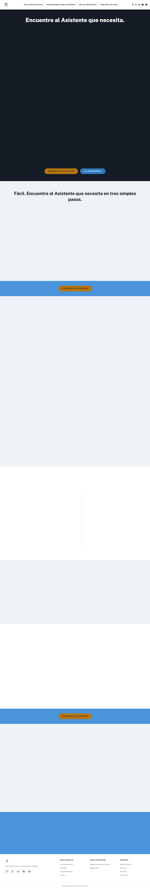

### 4.2 Acceso

Una sola puerta para los tres: correo y contraseña. Adónde va cada quien lo decide su papel.
Botón para mostrar u ocultar la contraseña, y enlace para recuperarla.

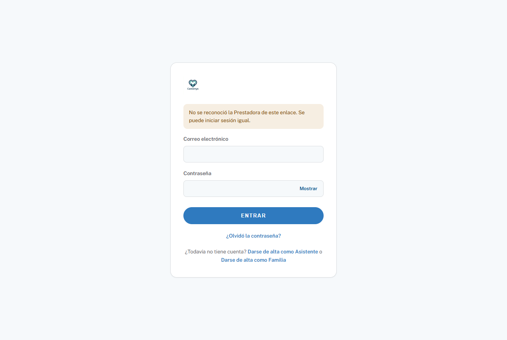

### 4.3 Alta de Familia

Nombre, correo y contraseña. Hay que confirmar el correo antes de poder entrar. **Sin Prestadora
identificada no se crea ninguna cuenta.**

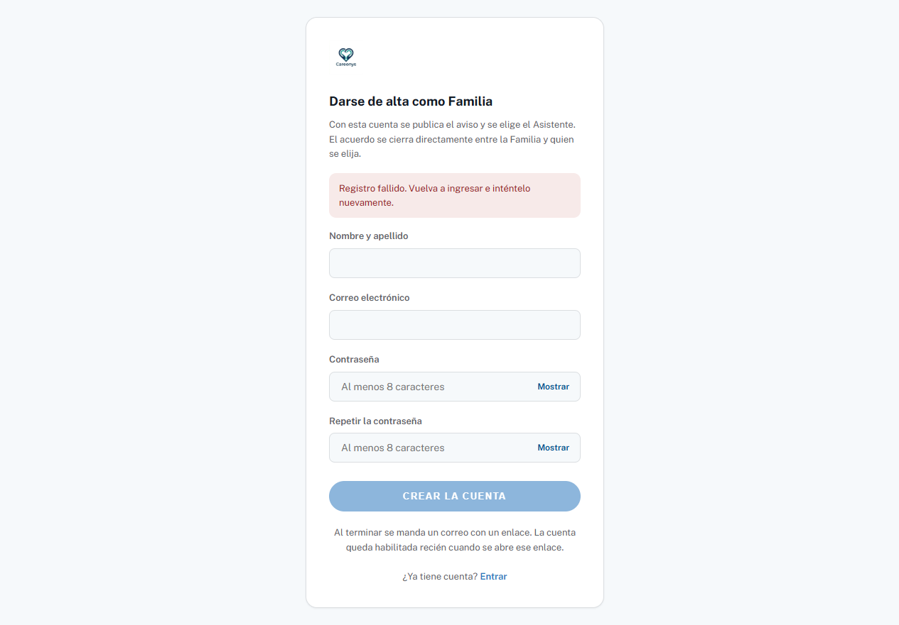

### 4.4 Alta de Asistente

Una mitad explica de qué se trata y la otra es un alta guiada en siete pasos: identidad y zonas
donde trabaja, formación, aptitudes, horarios en que puede, legajo (matrículas, estudios,
experiencias y referencias, todas repetibles), documentación y cierre.

Dos cosas que conviene saber: **la grilla de disponibilidad arranca vacía** y **la autorización
para publicarse arranca en «no»**. Terminar el alta no es estar publicado.

Del legajo se publica: nombre, foto, género, zonas, qué atiende, valor de referencia por hora y
las comprobaciones hechas. **Nunca se publica: documento, teléfono, correo ni domicilio.**

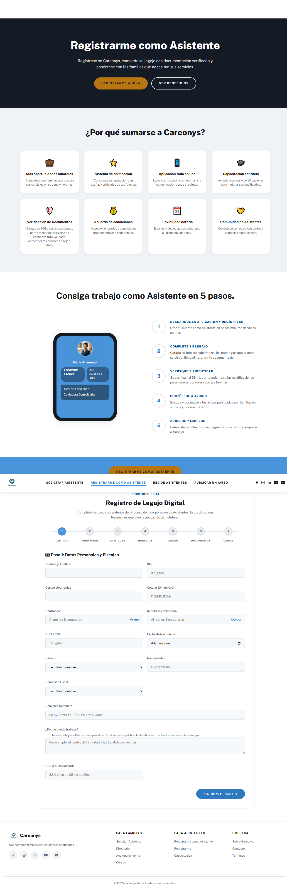

### 4.5 Recuperar la contraseña

Se pide con el correo. **La respuesta es siempre la misma exista o no esa cuenta**, para que
nadie pueda usar la pantalla para averiguar quién está registrado. Llega un enlace de un solo uso
que vence en una hora.

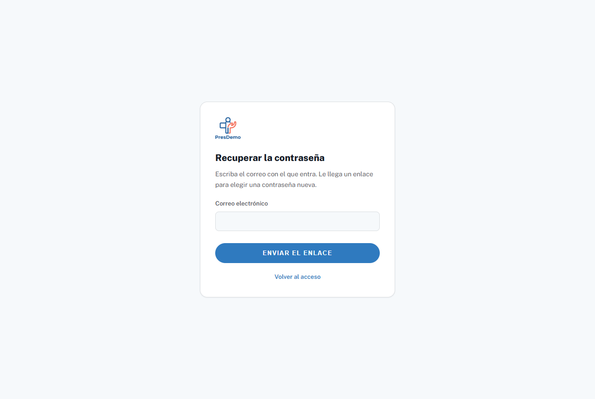

### 4.6 Elegir una contraseña nueva

Adonde lleva ese enlace. Mínimo ocho caracteres y repetición. Distingue el enlace vencido, el ya
usado y el rechazado.

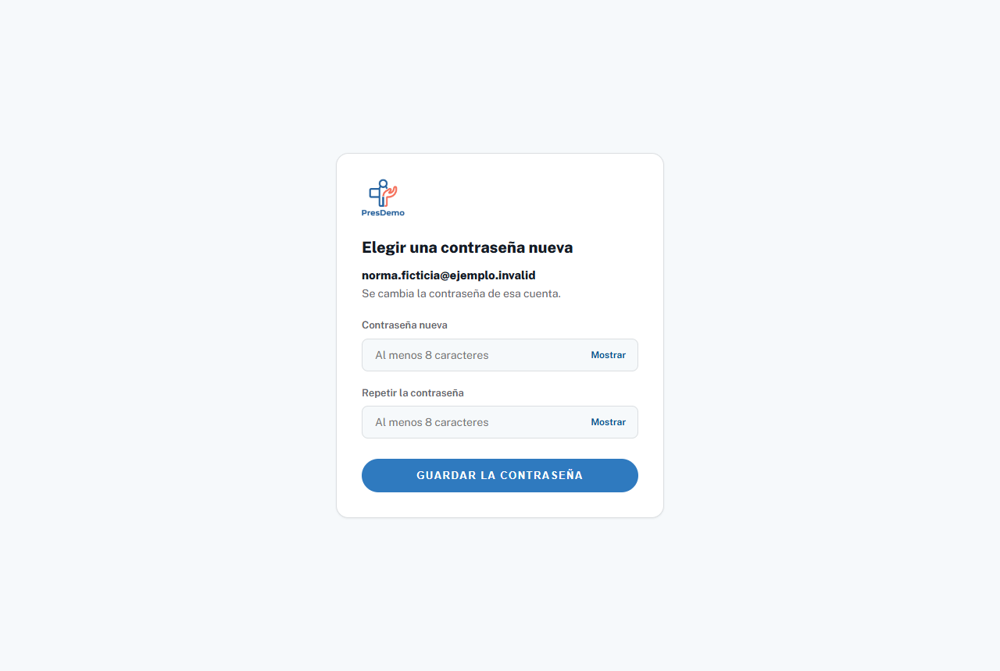

### 4.7 Directorio de Asistentes

Público, se ve sin tener cuenta. Búsqueda por nombre o por zona que no distingue acentos, y
filtros por zona, tipo, patología y comprobación. Cada tarjeta muestra foto, nombre, tipo,
género, zona, valor por hora con su moneda, si el legajo está validado, las comprobaciones y las
etiquetas.

**No muestra ningún dato de contacto, no tiene orden por ninguna columna, no tiene puntaje ni
estrellas y desde ahí no se contrata.** Está excluido de los buscadores de internet.

Para aparecer hacen falta tres cosas: legajo validado, autorización expresa de la persona, y las
comprobaciones obligatorias hechas.

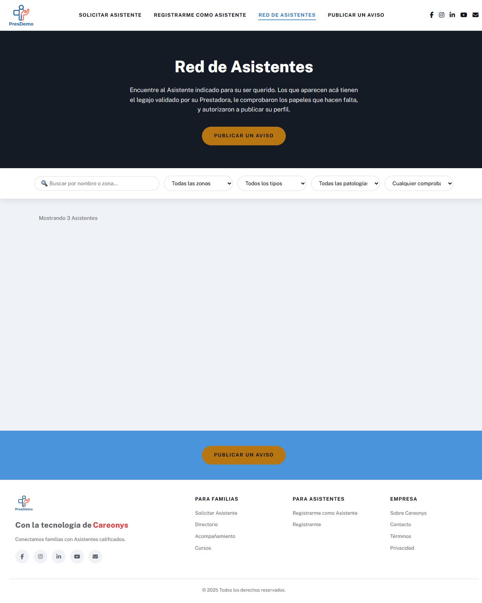

### 4.8 Perfil público del Asistente

Lo que se ve al abrir una tarjeta. **No muestra datos de contacto, ni estrellas, ni referencias,
ni estudios, ni biografía, ni la grilla de días.** El botón de contacto depende de quién mira:
sin sesión invita a entrar; siendo Familia abre la conversación; cualquier otro caso no muestra
botón.

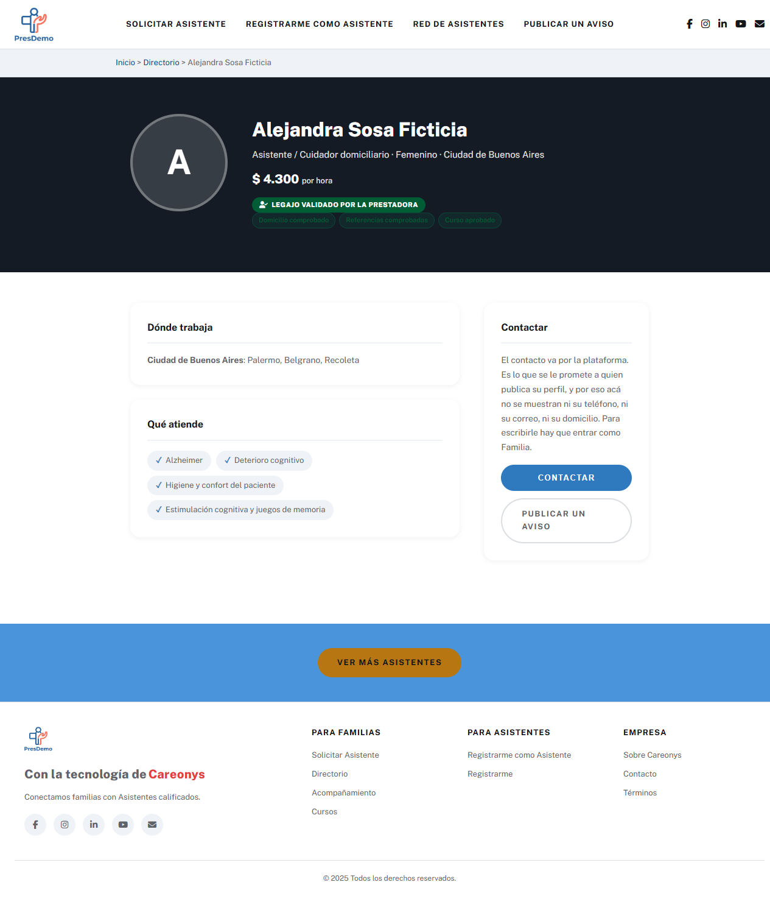

### 4.9 Solicitar un Asistente

Pantalla informativa que explica el camino del aviso y lleva a la aplicación de la Familia.

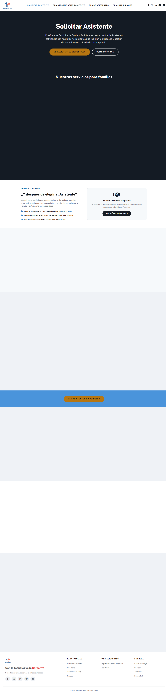

### 4.10 Cursos

Seis cursos con su carga horaria, nivel, modalidad y si certifican o no. **La inscripción de esta
pantalla no inscribe a nadie y hoy no registra nada**: termina ofreciendo un correo ya escrito.
No hay contenido de curso adentro del producto ni se emite ningún certificado.

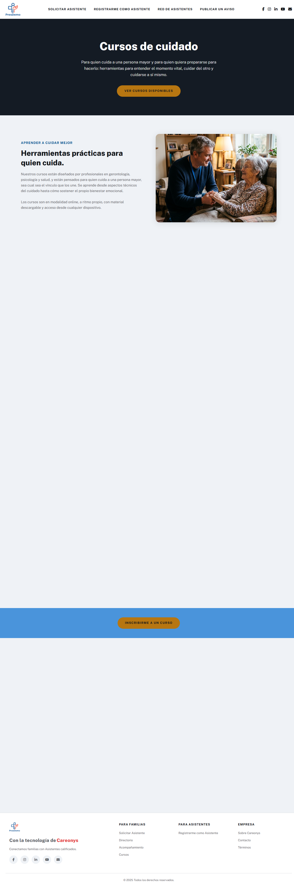

### 4.11 Evaluaciones

Para el Asistente que ya tiene legajo. Lista las evaluaciones publicadas por su Prestadora con el
estado de cada una. Antes de empezar dice cuántas preguntas tiene, qué porcentaje se necesita
para aprobar y cuántos intentos quedan. **La corrección se hace del lado del servidor y la
respuesta correcta nunca llega al navegador.**

Aprobar no cambia el legajo, no publica a nadie y no le avisa a nadie. No se puede ver en qué se
falló, ni revisar, ni apelar.

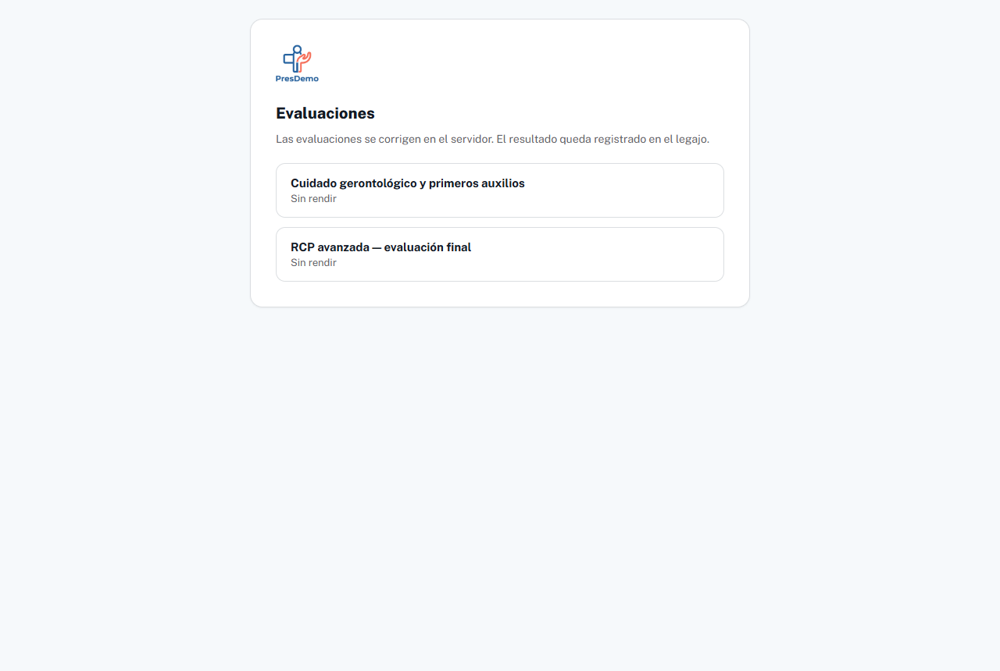

### 4.12 Panel de la Prestadora

Es la pantalla de trabajo del personal de coordinación, y es de escritorio. Tiene dos partes:
**los legajos** y **la configuración**.

Los legajos: dos contadores —en revisión y validados—, y la lista de aspirantes con su
documentación cargada, su estado y las acciones. Al abrir uno se ve la ficha del aspirante, los
tres documentos cargados —servidos con enlaces que vencen a los quince minutos—, las
comprobaciones que se marcan papel por papel, las resoluciones anteriores con su motivo, y la
resolución: un motivo obligatorio y validar o rechazar. Las dos se confirman, las dos quedan
escritas con su motivo, y ninguna se deshace: se vuelve a resolver.

La configuración: a las cuántas horas una jornada abierta se considera incompleta, la moneda con
la que trabaja, y las opciones propias de sus listas —agregar, corregir el texto, desactivar y
reactivar; nunca borrar.

**El panel no ve presentismo, ni ubicaciones, ni horas de nadie, ni reportes de cuidado, ni el
chat, ni los avisos de las familias. No asigna trabajo, no ve precios ni condiciones, y no
factura ni cobra.**

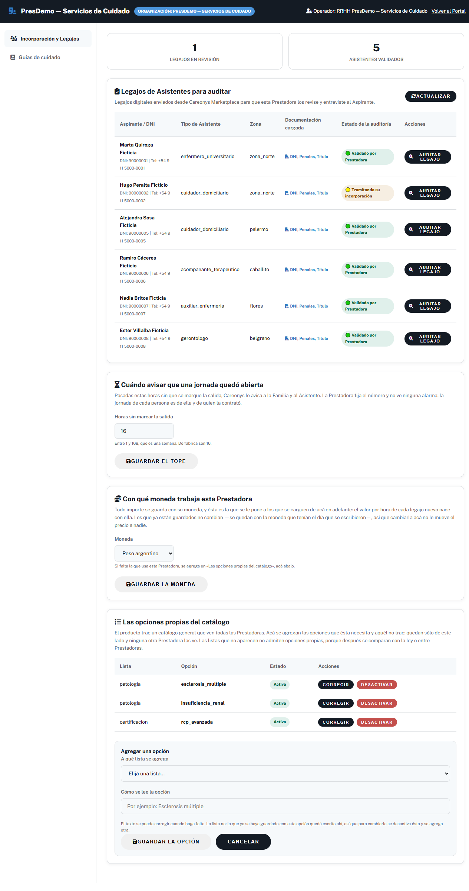

### 4.13 Guías de cuidado de la Prestadora

La Prestadora escribe sus propias guías, con cuatro textos obligatorios: qué es, qué se hace, qué
no se hace y cuándo llamar al médico. Se publican **sólo después de declarar quién las revisó y
en qué fecha**. Se pueden corregir y borrar.

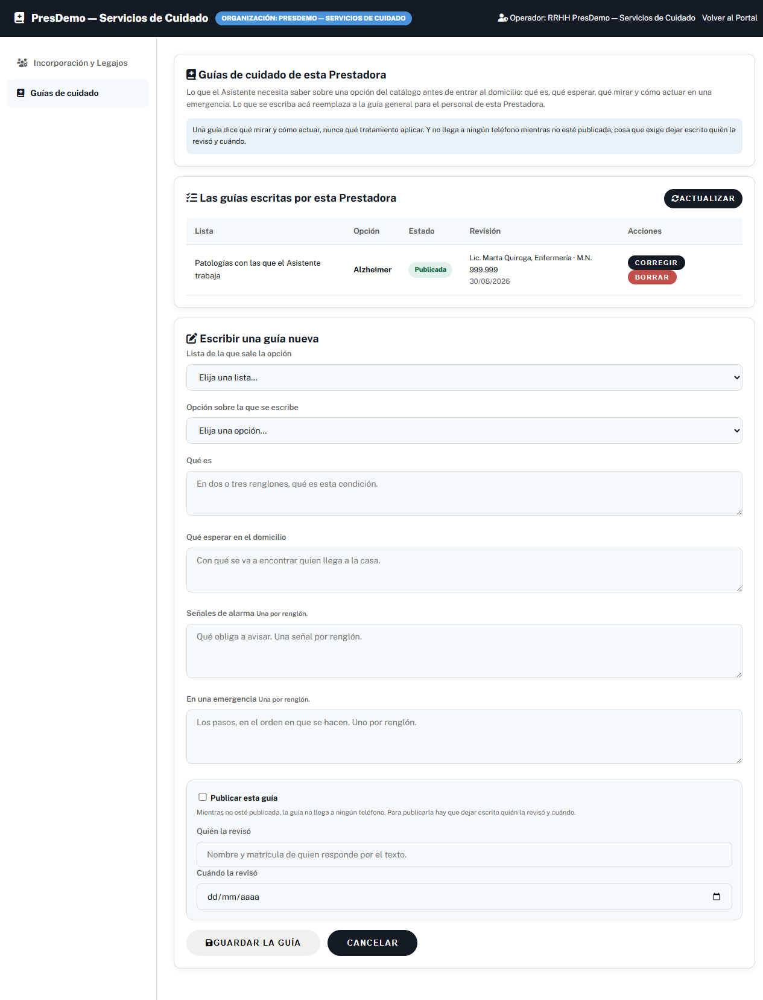

### 4.14 Acompañamiento en línea

Pantalla descriptiva de un servicio de acompañamiento remoto. **No toca ningún dato y su
formulario no registra nada**: termina ofreciendo un correo ya escrito.

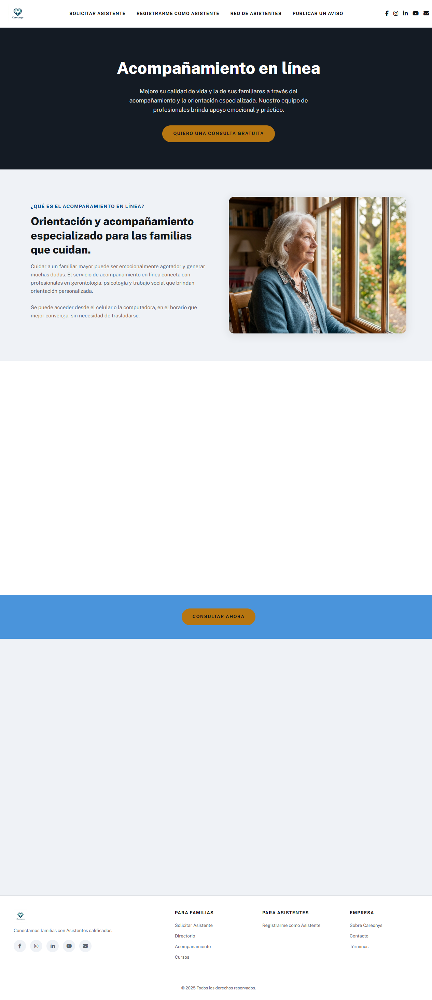

### 4.15 Demostración en teléfono

Una demostración adentro de la silueta de un teléfono, para mostrar el producto sin entrar.
**Es una maqueta y así hay que venderla**: los nombres, los diagnósticos y las tarjetas de curso
son ejemplos, y la marcación y el reporte que se prueban ahí quedan atribuidos siempre a un
asistente de prueba.

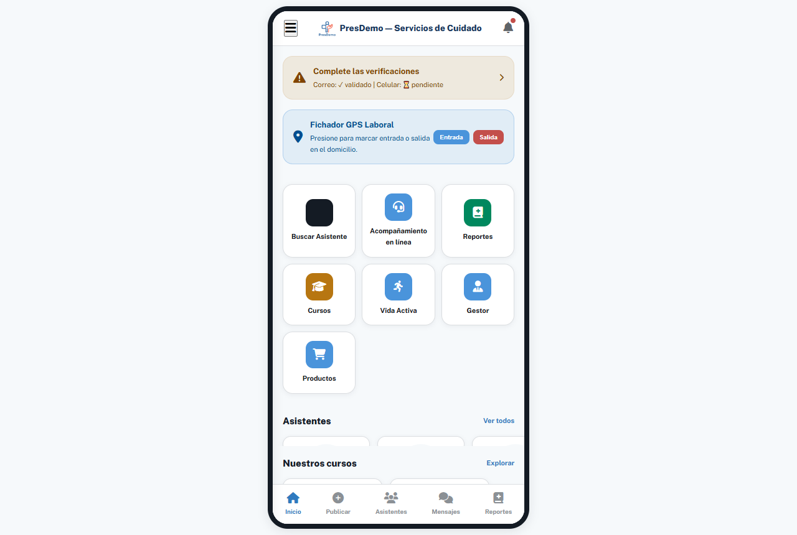

---

## 5. La aplicación del Asistente

Se instala en el teléfono desde el navegador, con ícono y nombre propios, y se abre a pantalla
completa.

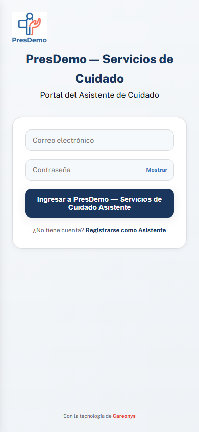

### 5.1 Inicio

Cuatro bloques: la franja de avisos automáticos, el estado del legajo, el fichador y el reporte
de la jornada.

**El fichador es lo más sólido del producto.** Marcar entrada y marcar salida, con un selector
opcional de para quién es la jornada, que por omisión queda en «sin decir para quién». Si nombra
a una familia, esa familia ve la marca; si no la nombra, la marca queda reservada. **La Prestadora
no la ve en ningún caso.** Pide la ubicación, y si la persona la niega o tarda lo dice, siempre
nombrando cuál de las dos marcas falló.

**El reporte de la jornada:** presión arterial, glucemia, medicamentos y novedades del día. La
nota es obligatoria.

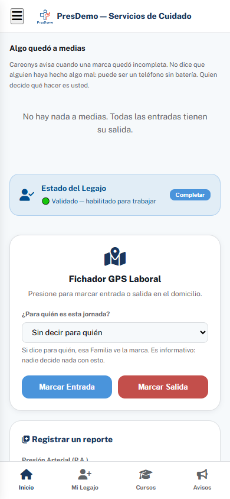

### 5.2 Completar el legajo

Un alta en cinco pasos adentro del teléfono: datos personales y zonas, formación con cuatro
archivos para cargar, experiencia, condiciones —valor por hora y grilla de días y franjas— y
referencias con autorizaciones. **Se llena entero sin señal**; sólo mandarlo necesita conexión.

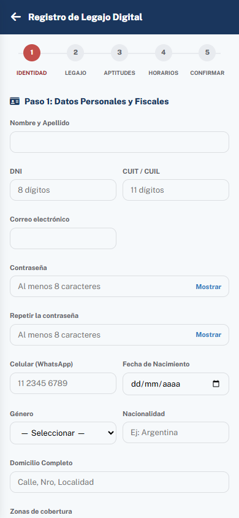

### 5.3 Avisos abiertos

Cada aviso con su descripción, motivo, zona, tipo, frecuencia, horario, género preferido, tareas,
patologías, fecha y la grilla de días desplegable. Se puede escribir un mensaje de presentación
—con una advertencia de no poner datos de contacto—, postularse y retirarse.

**No se ve quién es la Familia, ni ningún dato de contacto, ni ningún precio. No hay nada que
aceptar.** Quien no tiene legajo ve la pantalla vacía, y la pantalla lo dice.

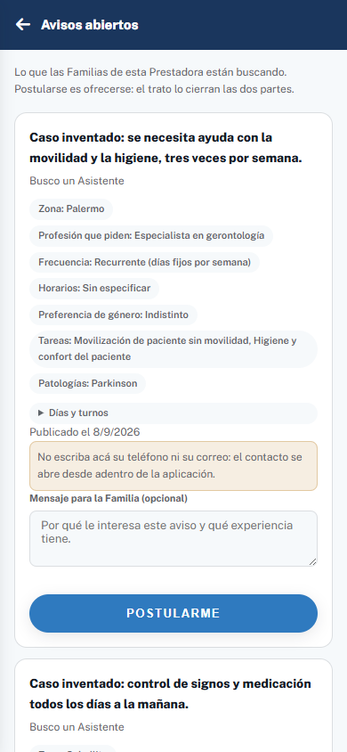

### 5.4 Mis capacitaciones

La lista de cursos con el estado de cada uno. El examen se rinde afuera, en el sitio web.

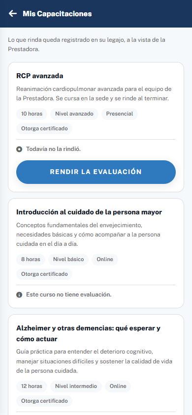

### 5.5 Guías de cuidado

Buscables, con las de la propia Prestadora marcadas. Dicen expresamente que no indican
tratamientos.

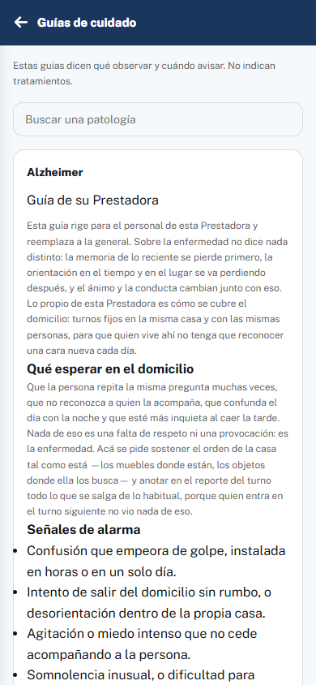

### 5.6 Mensajes

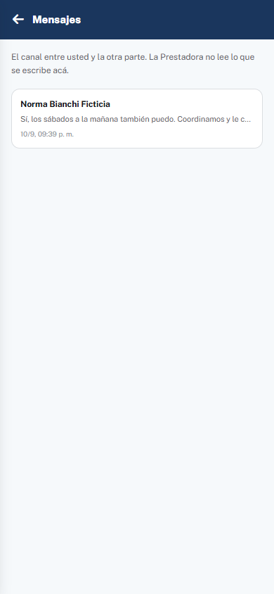

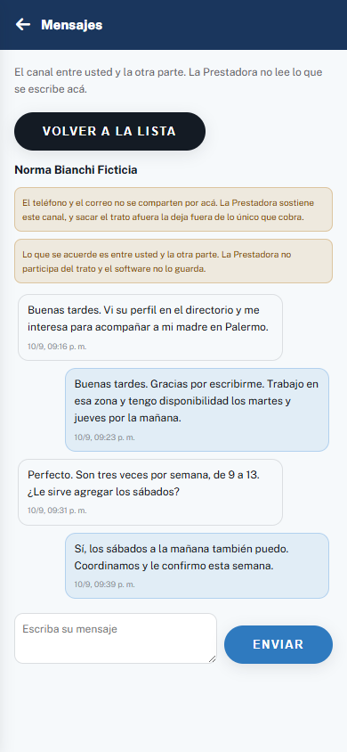

---

## 6. La aplicación de la Familia

También se instala desde el navegador. **El alta no está adentro del teléfono**: el enlace lleva
al sitio web llevando la Prestadora puesta.

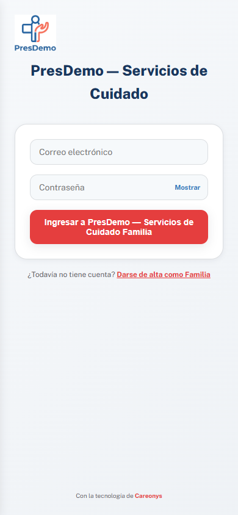

### 6.1 Inicio

Cuatro accesos y una franja horizontal con asistentes publicados. Dos de los accesos y la franja
salen al sitio web.

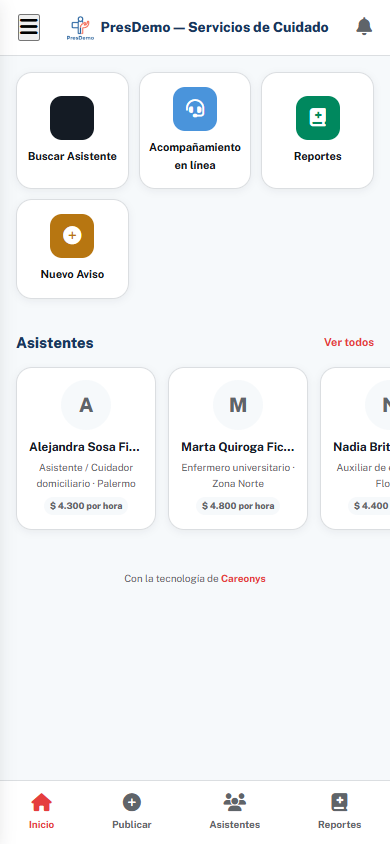

### 6.2 Publicar un aviso

Nombre del paciente, edad, zona, modalidad, grilla de días y franjas, patologías y una
descripción libre. Al enviarlo la pantalla se limpia y vuelve al inicio.

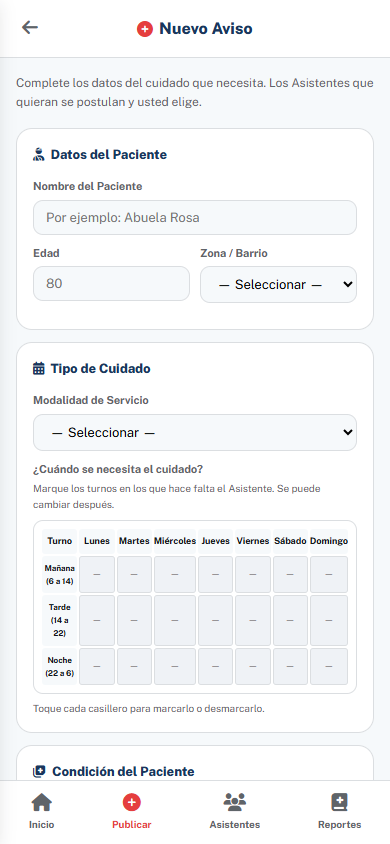

### 6.3 Quiénes se postularon

Una tarjeta por postulación, con foto, nombre, tipo, zona, el mensaje que escribió esa persona,
la fecha y la marca de nueva o descartada. Dos botones: hablar con esa persona —que abre la
conversación, o lleva a la que ya existe— y descartar, que anota la fecha.

**Descartar no borra nada, y no hay ningún botón de aceptar: el producto no registra
contrataciones.**

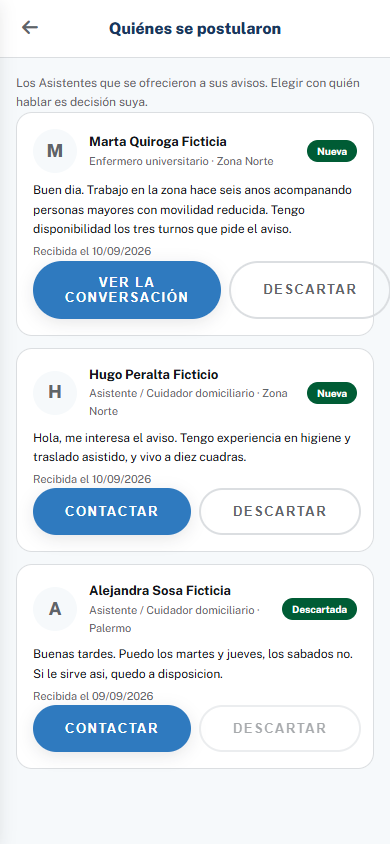

### 6.4 Asistencia

La franja de avisos automáticos, un filtro por vínculo, y una tarjeta por marca con el nombre de
la otra parte, si fue entrada o salida, **la hora tal como se marcó en el teléfono**, y un enlace
al mapa o la leyenda «sin ubicación».

**No hay nada que aprobar, no hay totales y no hay liquidación.** Sólo aparecen las marcas que el
Asistente vinculó a esa Familia.

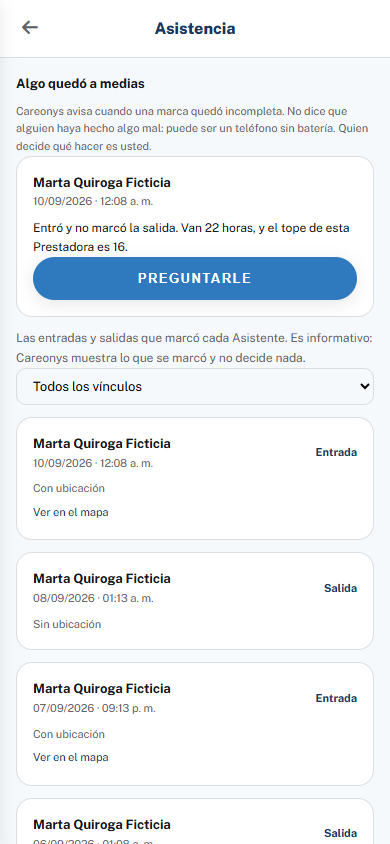

### 6.5 Reportes de cuidado

Una línea de tiempo con la hora, el título, la nota del día y los signos vitales cuando se
cargaron.

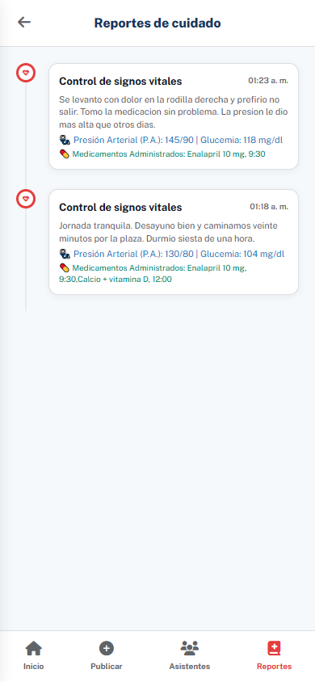

### 6.6 Mensajes

El mismo canal que ve el Asistente, con dos advertencias fijas arriba del cuadro de escritura: no
se comparten datos de contacto por acá, y el software no guarda ningún acuerdo.

**Un mensaje que contenga un teléfono, un correo o un domicilio se rechaza** y el texto se queda
en el cuadro. No hay archivos adjuntos, ni imágenes, ni audio, ni avisos de leído, ni edición, ni
borrado.

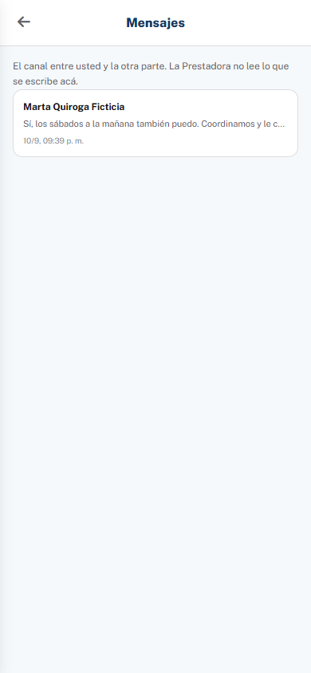

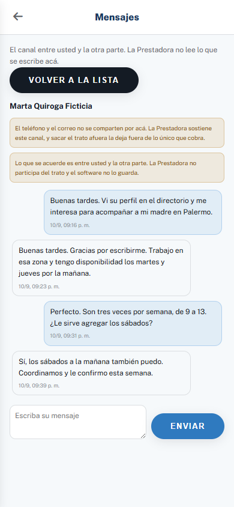

---

## 7. Los avisos automáticos

El producto detecta dos situaciones y las muestra a las dos partes:

- una jornada que quedó abierta más horas que el tope que configuró la Prestadora;
- una salida marcada sin su entrada.

Dice el nombre de la otra parte, la fecha y hora, las horas que pasaron y el tope, y ofrece un
solo botón, que abre la conversación. **No hay nada que aprobar, no hay totales y no acusa a
nadie.** Es informativo: muestra el hecho y no lo resuelve.

---

## 8. El circuito del aspirante: siete papeles, tres puertas

**Puerta 1 — para terminar el alta:** documento de identidad.

**Puerta 2 — para aparecer en el directorio y poder ser contratado:**

- **Antecedentes penales.** No frena el alta, porque el trámite es lento, pero corre un plazo de
  quince días desde el alta y vencido ese plazo el legajo queda **bloqueado**. Vale seis meses,
  por criterio de la Prestadora.
- **Certificado de salud.** Vale doce meses.
- **Matrícula vigente** y **título**, sólo donde el tipo de asistente los exige.

**Puerta 3 — suman, nunca frenan:** domicilio y referencia laboral verificada.

**Quién ve la validación.** El detalle —qué papel está hecho, cuál falta, cuál fue rechazado— lo
ven la Prestadora y el propio Asistente, y nadie más. La Familia ve sólo el resultado, y sólo
cuando todos los papeles obligatorios están validados.

---

## 9. Especificaciones

### 9.1 Idiomas

Tres: español rioplatense, inglés y portugués de Brasil. El español rioplatense es el que sale
por omisión.

Todo el texto visible sale de un único catálogo central con **983 frases, completas en los tres
idiomas**. Hay una sola falta de traducción en todo el producto: una opción de modalidad de
contratación que está escrita en español y no en los otros dos.

Las fechas, las horas y los importes se muestran según el idioma elegido.

**No hay ningún botón para cambiar de idioma.** El idioma se elige solo: primero lo que venga
indicado en la dirección web, después lo que se usó la vez anterior en ese aparato, y si no, el
idioma del navegador.

### 9.2 Aparatos e instalación

Funciona en teléfono, tablet y computadora. Es web: se entra con la dirección y listo, sin
instalar nada.

Las dos aplicaciones de teléfono —la del Asistente y la de la Familia— **se instalan desde el
propio navegador**, no desde una tienda. Tienen ícono y nombre propios y se abren a pantalla
completa. **No hay aplicación de Google Play ni de App Store.** Se actualizan solas la próxima
vez que se abren con señal. Son dos aplicaciones separadas y conviven en un mismo teléfono.

La del Asistente necesita el permiso de ubicación.

Anda en cualquier navegador actualizado. En navegadores viejos no va a estar disponible ni la
instalación como aplicación ni el trabajo sin señal. **No hay una lista de versiones mínimas
probadas.**

El producto usa cinco servicios externos: una biblioteca de datos, una de íconos, dos de
tipografías y un servidor de mapas. Si alguno está caído, la pantalla se ve peor pero se ve.

### 9.3 Sin señal

**Lo que sigue andando:**

- Las dos aplicaciones abren y muestran sus pantallas, sus textos y sus listas de opciones.
- El legajo del Asistente se llena entero.
- **Las marcaciones de entrada y salida se guardan en el teléfono antes de intentar mandarlas.**
  Guardan la hora en que se apretó el botón, no la hora en que llegaron. Se reintentan solas
  cuando vuelve la señal, cuando se vuelve a abrir la aplicación y cada vez que arranca. No se
  duplican. Después de cinco rechazos del servidor dejan de reintentarse, **pero no se borran
  nunca**.

**Lo que no anda sin señal:**

- Entrar. Iniciar sesión necesita conexión.
- Buscar asistentes, ver avisos, abrir un legajo, mandar o recibir mensajes.
- **El reporte de la jornada no tiene cola de espera: sin señal se pierde.**
- **Una marcación hecha con el teléfono sin señal desde el arranque no llega a guardarse**: antes
  de guardarla la pantalla le pregunta al servidor de quién es la sesión, y esa pregunta necesita
  red. La cola protege bien la señal mala o intermitente y el servidor que no contesta; no
  protege el teléfono sin señal desde el principio.
- Los íconos, las tipografías y el mapa no están guardados en el teléfono, así que sin señal se
  ve más pobre.

### 9.4 Separación entre clientes

**Dos Prestadoras no ven absolutamente nada una de la otra.**

Cada dato lleva marcado a qué Prestadora pertenece, y la separación no está puesta en la pantalla
sino adentro de la base de datos. Las 36 tablas del producto la tienen, sin excepción, con 64
reglas de acceso. Los archivos siguen la misma regla: sólo se leen si están en la carpeta de su
dueño y la Prestadora coincide.

Dicho en una frase de venta: **aunque una pantalla pidiera mal los datos, o alguien consultara el
servidor por fuera de la aplicación, seguiría recibiendo únicamente lo de su propia Prestadora.**

Y no es una promesa: hay una prueba automática que crea siete cuentas ficticias repartidas en dos
Prestadoras y verifica veintiún puntos —que nadie lea ni escriba datos de la otra, que nadie se
ascienda solo, que los archivos privados estén cerrados sin sesión, y que el directorio público
no mezcle Prestadoras ni exponga datos personales—. La prueba carga datos de verdad y después
intenta alcanzarlos desde el otro lado.

### 9.5 Qué datos guarda

**Del Asistente:** nombre, documento, clave tributaria, fecha de nacimiento, género,
nacionalidad, profesión, correo, teléfono, domicilio, zonas, datos bancarios, estudios, cursos,
matrículas, experiencia, referencias, los archivos que cargó con su fecha y su vencimiento, las
comprobaciones, las resoluciones con su motivo, su disponibilidad por día y turno, y su valor de
referencia por hora con su moneda.

**Del Paciente:** nombre, edad, zona, motivo de consulta, tareas, frecuencia y patologías, tal
como los carga la Familia adentro del aviso.

**De la jornada:** las marcas de entrada y salida con su ubicación y la hora en que se marcaron,
y los reportes de cuidado con presión, glucemia, medicación y novedades.

**De la comunicación:** el contenido completo de las conversaciones, con autor y fecha.

**Lo que no guarda:** el contrato entre la Familia y el Asistente. Ni el precio acordado, ni las
condiciones, ni la aceptación de ninguna de las dos partes. **Guarda que se pusieron en contacto,
y nada más.** Tampoco guarda datos de tarjeta, cobros, pagos ni facturas. Las contraseñas no
viven en el producto.

### 9.6 Entrada y contraseñas

- Correo y contraseña. **Mínimo ocho caracteres**, sin exigencia de mayúsculas, números ni
  símbolos.
- Hay que confirmar el correo antes de poder entrar, y la confirmación se puede reenviar.
- Se puede recuperar la contraseña, y **la pantalla nunca dice si esa dirección existe**.
- Cambiar el correo de la cuenta exige confirmar desde las dos direcciones.
- El código de un solo uso tiene ocho dígitos y vence a la hora.
- El envío de correos está limitado, para que nadie use el sistema como máquina de mandar mails.
- **No se entra con Google, Facebook ni Apple**: no hay ningún acceso de terceros.
- **No hay segundo factor usable.** Está habilitado del lado del servidor y ninguna pantalla lo
  ofrece.

El error de entrada no permite distinguir «esa persona no existe» de «la contraseña está mal».

### 9.7 Archivos

Dos depósitos, con reglas distintas y controladas en tres lugares a la vez:

| | Foto de perfil | Documentación |
|---|---|---|
| Tamaño máximo | 5 megabytes | 10 megabytes por archivo |
| Formatos | JPG, PNG, WEBP y HEIC | los mismos más PDF |
| Quién la ve | es pública | es privada: se sirve con un enlace que vence |

Cada archivo se guarda con un nombre único y no pisa a ninguno anterior. No hay tope de cantidad
de archivos por persona, y las fotos no se comprimen: lo que se sube es lo que queda.

### 9.8 Límites

| Qué | Cuánto |
|---|---|
| Idiomas | 3 |
| Foto de perfil | 5 megabytes |
| Documentación | 10 megabytes por archivo |
| Contraseña | mínimo 8 caracteres, sin máximo |
| Código de un solo uso | 8 dígitos, vence a la hora |
| Enlace a un documento privado | vence a los 15 minutos en el panel, a los 5 en el resto |
| Reintentos de una marcación | 5, y después queda guardada sin borrarse |
| Mensajes que se traen por vez | los últimos 50 |
| Marcaciones que se traen por consulta | las últimas 200 |
| Tope de jornada abierta | configurable entre 1 y 168 horas; de fábrica, 16 |

**Lo que no tiene límite:** la cantidad de asistentes, familias, avisos, mensajes y archivos por
Prestadora; la cantidad de Prestadoras; y el largo de casi todos los campos de texto —un mensaje
o una nota del día pueden ser tan largos como se quiera—.

**No hay paginado en las listas**, y no hay pruebas de volumen: no está medido cómo se comporta
una pantalla con miles de asistentes o de mensajes.

### 9.9 Accesibilidad

**Lo que está hecho:** los colores cumplen el contraste mínimo de la norma internacional; hay
paleta oscura completa que se enciende sola si el aparato está en modo oscuro; se respeta la
preferencia de reducir movimiento; y hay un anillo de foco visible para quien navega con teclado.

**Lo que no está hecho:** los tamaños de letra están fijos, así que **si alguien agranda la letra
en su teléfono o su navegador el producto no lo acompaña**; no hay control propio de tamaño ni de
contraste, ni botón de modo oscuro; no hay enlace de «saltar al contenido»; los lectores de
pantalla no se enteran cuando algo cambia solo; y de 58 imágenes, 22 no tienen texto alternativo.

Dicho de frente: **tiene buenos cimientos y no está hecho para ser accesible.** No hay auditoría
de accesibilidad ni declaración de conformidad con ninguna norma.

---

## 10. Lo que el producto no hace

Dicho de frente, para que nadie lo venda de más:

- **No cobra ni paga.** No procesa tarjetas, no emite facturas, no liquida sueldos, no calcula
  comisiones. Pide los datos bancarios del Asistente en su legajo, pero no mueve un peso.
- **No guarda el trato.** Ni precio, ni condiciones, ni aceptación, ni firma. Es a propósito.
- **No manda ninguna notificación.** Ni al teléfono, ni por correo, ni sonido, ni vibración, ni
  nada en la pantalla bloqueada. No está apagado: no está construido. Todo se ve abriendo la
  aplicación. **Quien venda «le avisa al instante» está vendiendo algo que el producto no hace.**
- **No está en las tiendas de aplicaciones.**
- **No tiene planes, cupos ni medición de consumo por Prestadora.**
- **No tiene tablero de indicadores ni exportación a Excel o PDF.**
- **No tiene aplicación para la Prestadora**: su panel es de escritorio.
- **No valida identidad contra ningún organismo.** La verificación de documentación es una
  revisión humana de la Prestadora.
- **El chat es sólo texto:** no hay llamada, ni videollamada, ni archivos adjuntos.
- **No calcula distancias ni rutas:** la zona es un texto elegido de una lista, no un mapa con
  radio.
- **No hay bitácora de accesos consultable por el dueño.**
- **El respaldo y la recuperación no son del producto:** quedan del lado del servicio de base de
  datos contratado.
- **La Familia no puede** contratar, ver datos de contacto del Asistente ni siquiera por el chat,
  fichar ni corregir una marca, ver totales de horas, cargar una ficha clínica del Paciente,
  editar o retirar un aviso ya publicado, listar sus propios avisos, deshacer un descarte,
  calificar, ni darse de alta desde el teléfono.
- **El Asistente no puede** ver su propio historial de reportes, aceptar o rechazar trabajo, ver
  quién es la Familia, ver la ficha del Paciente, rendir el examen adentro de la aplicación,
  corregir o borrar una marcación, ver sus horas totales, adjuntar fotos o audio, abrir una
  conversación —la abre la Familia—, ni borrar su cuenta o descargar sus datos.

---

## 11. Lo que está a medias

Se dice acá para que no se venda como terminado:

- **El reporte de cuidado escrito desde el teléfono no llega a ninguna Familia.** Se guarda sin
  quedar atado al aviso, y la regla de acceso exige justamente ese vínculo. La pantalla de la
  Familia lee bien y muestra bien; lo que falla es el lado que escribe.
- **La campanita de la aplicación de la Familia no hace nada.** Es decoración que promete
  notificaciones que no existen.
- **Nadie mira los plazos ni los vencimientos de la documentación.** Están definidos y no están
  construidos.
- **Cuánto suman el domicilio y la referencia laboral está sin decidir**, y cómo se muestra
  también.
- **Qué instrumento exacto vale como certificado de salud está sin decidir.**
- **La inscripción a los cursos no existe** y termina en un correo. **No hay contenido de curso**
  y **no se emite ningún certificado**, aunque se declare que certifican.
- **No hay pantalla para crear evaluaciones** y **no hay ninguna donde la Prestadora vea los
  resultados**, aunque la pantalla pública de cursos diga que los ve.
- **Las consultas de acompañamiento en línea no se registran** y terminan en un correo.
- **Los avisos de las familias vistos desde el lado de la Prestadora están sin definir.**
- **La facturación, las comisiones y el cobro están frenados por alcance.**
- **La demostración en teléfono mezcla partes reales con contenido de ejemplo.**

---

## 12. Tres cosas que conviene tener presentes al vender

1. **El fichador es lo más sólido que tiene el producto.** Se puede vender con confianza: guarda
   la hora real, no se duplica, no se pierde y se manda solo.
2. **El producto guarda el contacto, no el trato.** En ninguna parte hay un precio acordado, una
   aceptación, una contratación, un pago ni una liquidación. Es deliberado y es consistente en
   todo el producto.
3. **No hay ninguna notificación.** Nada le avisa a nadie de nada. Todo se ve abriendo la
   aplicación.
