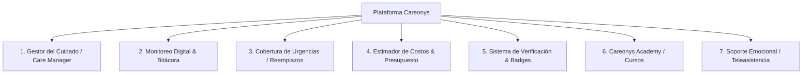

# Análisis Profundo de Cuidarlos.com y Funcionalidades para Incorporar en Careonys

Este documento presenta una auditoría detallada de las características, servicios y herramientas presentes en la plataforma de referencia `cuidarlos.com`, proponiendo la hoja de ruta para incorporar estas funcionalidades en el software **Multi-Tenant Careonys**.

---

## 1. Módulos y Servicios Identificados en Cuidarlos.com

---

## 2. Detalle de Funcionalidades Propuestas para Careonys

### Módulo 1: Gestor del Cuidado (Care Manager)
* **¿Qué es?**: Un profesional especialista asignado a la familia que coordina el plan de cuidado personalizado, supervisa al asistente y gestiona emergencias.
* **Propuesta para Careonys**: 
  * Crear la vista/modal del **Gestor del Cuidado** donde la familia puede agendar una videollamada inicial de diagnóstico.
  * Tablero de supervisión donde el Gestor aprueba los informes diarios del asistente.

### Módulo 2: Monitoreo Digital & Bitácora de Salud en Tiempo Real
* **¿Qué es?**: Aplicación de seguimiento donde el asistente registra el estado diario del paciente.
* **Propuesta para Careonys**:
  * **Check-in / Check-out Geolocalizado**: Registro de entrada y salida del turno.
  * **Bitácora de Signos Vitales**: Formulario diario para registrar presión arterial, temperatura, glucemia y pulso.
  * **Control de Medicación**: Lista de verificación (checklist) de medicamentos administrados con hora y dosis.
  * **Diario de Actividades & Ánimo**: Reporte de alimentación, hidratación, paseo y estado anímico.

### Módulo 3: Calculadora de Horas y Estimador de Presupuesto Interactivo
* **¿Qué es?**: Herramienta interactiva para que las familias calculen el costo estimado del servicio antes de contratar.
* **Propuesta para Careonys**:
  * Widget en la portada y en `solicitar-asistente.html` con selectores de:
    * Días a la semana (1 a 7 días).
    * Horas por día (4hs, 8hs, 12hs, 24hs).
    * Tipo de servicio (Cuidado general, Enfermería especializada, Acompañamiento).
  * **Resultado instantáneo**: Presupuesto mensual estimado + botón "Solicitar Asistente con este Plan".

### Módulo 4: Garantía de Reemplazo Urgente (Backup Guard)
* **¿Qué es?**: Seguro de continuidad del servicio si el asistente asignado falta por enfermedad o imprevisto.
* **Propuesta para Careonys**:
  * Botón de alerta de emergencia "Solicitar Reemplazo Inmediato" en el panel del cliente.
  * Sistema de guardia que notifica a los asistentes disponibles en un radio de 5km.

### Módulo 5: Verificación de Antecedentes de 4 Niveles (Verification System)
* **¿Qué es?**: Proceso de validación riguroso para dar confianza a las familias.
* **Propuesta para Careonys**:
  * Badges visibles en las tarjetas del directorio ([directorio.html](file:///f:/proyectos/Careonys-Marketplace/directorio.html)):
    1. `DNI / Identidad Validada`
    2. `Antecedentes Penales Verificados`
    3. `Referencias Laborales Comprobadas`
    4. `Título / Matrícula Verificada`

### Módulo 6: Academia de Formación Continua (Careonys Academy)
* **¿Qué es?**: Formación para profesionales e instructivo para familias.
* **Propuesta para Careonys**:
  * Sección interactiva de **Cursos con Certificación Digital** en [cursos.html](file:///f:/proyectos/Careonys-Marketplace/cursos.html).
  * Exámenes breves de validación que otorgan puntos reputacionales (`CUIDADOR BRONCE` $\rightarrow$ `PLATA` $\rightarrow$ `ORO`).

---

## 3. Plan de Implementación de Nuevos Componentes en Careonys

1. **Calculadora Interactiva de Presupuesto**: Agregar componente dinámico en JS a `solicitar-asistente.html`.
2. **Widget de Bitácora y Registro de Medicación**: Incorporar simulación visual del panel de control en `perfil.html` y `directorio.html`.
3. **Badges de Verificación de 4 Niveles**: Mejorar las tarjetas del directorio con insignias de confianza.
