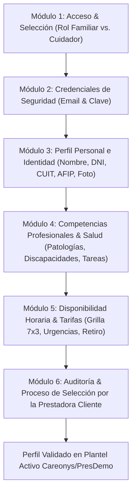

# Análisis Exhaustivo del Proceso de Reclutamiento de Cuidarlos.com & Modelo de Validación Careonys SaaS (CeltaTech)

**Origen de Datos**: Colección de 64 Capturas de Pantalla y Extracto de Contenido Oficial  
**Fecha de Análisis**: 4 de Agosto de 2026  
**Proyecto**: Careonys Marketplace (Software producido por **CeltaTech**)  
**Competidor Analizado**: **Cuidarlos.com** (Competidor directo)  

---

## 1. Resumen Ejecutivo del Análisis

A partir del estudio minucioso del material extraído de las fotos de la aplicación de reclutamiento del competidor **Cuidarlos.com**, se ha reconstruido el mapa de navegación, el formulario de onboarding para cuidadores (34 pantallas divididas en 6 módulos) y el flujo de validación del perfil.

### 🌟 Arquitectura del Modelo de Negocio (CeltaTech / Careonys SaaS):
* **Empresa de Software**: **CeltaTech** comercializa la plataforma **Careonys** bajo la modalidad **SaaS**.
* **Módulo Marketplace**: Paquete del software Careonys para la búsqueda, contratación y selección de asistentes.
* **Empresas Prestadoras Clientes (Tenants)**: Clientes como **PresDemo** adquieren la plataforma SaaS e integran su propio modelo de auditoría institucional:
  1. El aspirante a cuidador se registra y completa su legajo digital en Careonys Marketplace.
  2. Su estado inicial queda como 🔴 **"No Validado / En Revisión"**.
  3. La **Empresa Prestadora Cliente (ej: PresDemo)** toma la base de datos de aspirantes, audita la documentación (DNI, CUIT/AFIP, Penales, Matrícula) y realiza las entrevistas de selección presenciales o virtuales.
  4. Una vez **aprobado por la prestadora**, el profesional pasa al estado 🟢 **"Validado por Careonys"** y se incorpora al plantel activo recomendado a las familias.

---

## 2. Desglose Módulo por Módulo de la App de Reclutamiento (34 Pantallas Auditadas)

---

### Módulo 1: Acceso y Selección de Rol (Fotos 1 - 2)
* **Pantalla de Entrada (Login / Registro)**:
  - Botón principal fucsia: `Registrarse`.
  - Formulario de Login: `Correo electrónico`, `Contraseña` (con visor de caracteres), `¿Olvidaste tu contraseña?`.
  - Login social: Botón Google + Botón Facebook.
  - Avales de respaldo institucional en el footer.
* **Selección de Rol (`¿Cómo quisieras ingresar?`)**:
  - `Como familiar`: Busca cuidador para persona mayor.
  - `Como cuidador`: Busca trabajar como cuidadora de un paciente.

---

### Módulo 2: Credenciales de Seguridad (Foto 3)
* **Datos de la cuenta (Validación Doble)**:
  - `Correo electrónico` (con indicador visual de tilde verde en formato válido).
  - `Repetir correo electrónico` (verificación de coincidencia).
  - `Contraseña` & `Repetir contraseña` (mínimo de caracteres).
  - Checkbox obligatorio de Términos y Condiciones.

---

### Módulo 3: Perfil Personal e Identidad Civil/Fiscal (Fotos 4 - 17)
1. **Identidad Básica**: `Nombre` y `Apellido`.
2. **Fecha de Nacimiento**: Selector de calendario con validación de mayoría de edad (≥ 18 años).
3. **Género**: Dropdown (`Indistinto`, `Masculino`, `Femenino`, `Prefiero no contestar`).
4. **Nacionalidad**: Selector cerrado con scroll de países.
5. **Identificación Civil y Fiscal**:
   - `Número de DNI` (sin puntos).
   - `Número de CUIT/CUIL` (sin guiones ni espacios).
   - `Tipo de registro AFIP` (Dropdown: *No inscripto*, *Monotributo social*, *Monotributo*, *Responsable Inscripto*).
6. **Teléfono Celular**: Validación con código de área.
7. **Fotografía de Perfil Profesional**: Carga de foto de rostro tipo carnet.
8. **Ubicación Domiciliaria**: Autocomplete de Google Places.
9. **Zona de Cobertura Laboral**: Selección del radio en kilómetros o barrios.

---

### Módulo 4: Competencias Profesionales, Patologías & Tareas (Fotos 18 - 31)

#### A. Nivel Educativo & Títulos (Fotos 18 - 25)
* Carga de documentación en imagen/PDF:
  - 🛡️ **Foto de DNI (Frente y Dorso)**
  - 📋 **Certificado de Antecedentes Penales**
  - 📜 **Títulos de Enfermería / Cuidador Gerontológico / Matrícula Profesional**

#### B. Patologías & Diagnósticos Atendidos (Foto 28)
* *Alzheimer / Demencia Senil*
* *Parkinson*
* *Accidente Cerebrovascular (ACV)*
* *Diabetes / Control de Insulina*
* *Pacientes Postrados / Escaras*
* *Cuidados Paliativos / Oncología*

#### C. Tareas y Aptitudes Funcionales (Fotos 29 - 31)
* **Tareas de Acompañamiento**: *Acompañar a turnos médicos*, *Pasear con el paciente*, *Trámites*.
* **Tareas de Cuidado Directo**: *Aplicación de inyecciones*, *Higiene y confort*, *Control de signos vitales*, *Administración de medicación*.
* **Tareas Domésticas**: *Cocinar*, *Limpieza*, *Lavado de ropa*, *Tendido de cama*.

---

### Módulo 5: Disponibilidad Horaria & Tarifas (Fotos 32 - 34)
* **Modalidades de Trabajo Aceptadas**: *Reemplazos urgentes*, *Con retiro*, *Sin retiro (Cama adentro)*.
* **Grilla Semanal de Disponibilidad (Matrix 7x3)**:
  - 7 Días x 3 Turnos: *Mañana (06:00-14:00)*, *Tarde (14:00-22:00)*, *Noche (22:00-06:00)*.

---

### Módulo 6: Estado de Verificación y Flujo de Selección de Careonys Marketplace (Fotos 35 - 47)
* **Estado Inicial**: 🔴 **"No Validado / En Revisión"**.
* **Proceso de Selección por la Prestadora (ej: PresDemo)**:
  1. Ingreso del legajo digital al software Careonys.
  2. Auditoría documental (DNI, AFIP, Penales, Matrícula).
  3. Entrevista técnica y psicotécnica por parte del equipo de RRHH de la prestadora.
  4. Cambio de estado a 🟢 **"Validado por Careonys"** e incorporación al plantel activo recomendado.
