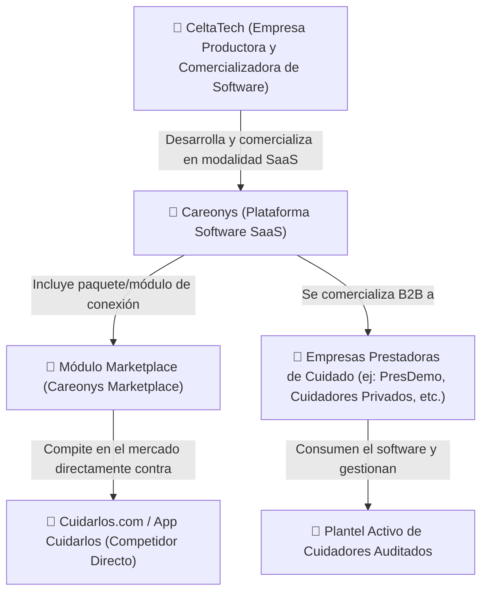

# Arquitectura Corporativa y Modelo de Negocio: CeltaTech / Careonys SaaS

**Fecha de Actualización**: 4 de Agosto de 2026  
**Proyecto**: Careonys Marketplace  
**Estado**: Documento Oficial de Definición de Dominio  

---

## 1. Definición del Esquema Corporativo

El ecosistema de negocios y desarrollo de software responde a la siguiente estructura formal:

---

## 2. Desglose de Actores y Roles

### 🏢 CeltaTech
* **Rol**: Empresa tecnológica creadora, desarrolladora y comercializadora de la plataforma de software.
* **Modelo de Comercialización**: B2B Software as a Service (SaaS).

### 🚀 Careonys
* **Rol**: El producto de software SaaS insignia creado por CeltaTech.
* **Módulo Marketplace**: Paquete dentro de Careonys que habilita el portal interactivo y el catálogo digital de búsqueda, contratación y reclutamiento de asistentes/cuidadores gerontológicos.

### 🏥 Prestadoras Cliente (Tenants SaaS) - ej: PresDemo
* **Rol**: Clientes B2B que adquieren la licencia SaaS de Careonys para operar su propia red de prestaciones.
* **Función Operativa**:
  - Recepción de postulaciones de cuidadores.
  - Auditoría de documentación civil, fiscal y técnica (DNI, AFIP, Penales, Matrícula).
  - Entrevistas de selección presenciales o virtuales.
  - Asignación de badges de verificación e incorporación de los cuidadores aprobados al **Plantel Activo**.

### 🔴 Cuidarlos (`cuidarlos.com` / `app.cuidarlos.com`)
* **Rol**: Competidor directo en el mercado de atención domiciliaria y cuidado de adultos mayores.

---

## 3. Estado de Denominaciones Obsoletas

* 🚫 **Sendler Group**: Queda **DEPRECADO / EN EL PASADO**. Toda referencia en código o documentación debe reemplazarse por el esquema **CeltaTech** (empresa desarrolladora), **Careonys** (producto SaaS Marketplace) y **PresDemo** (empresa cliente prestadora).
