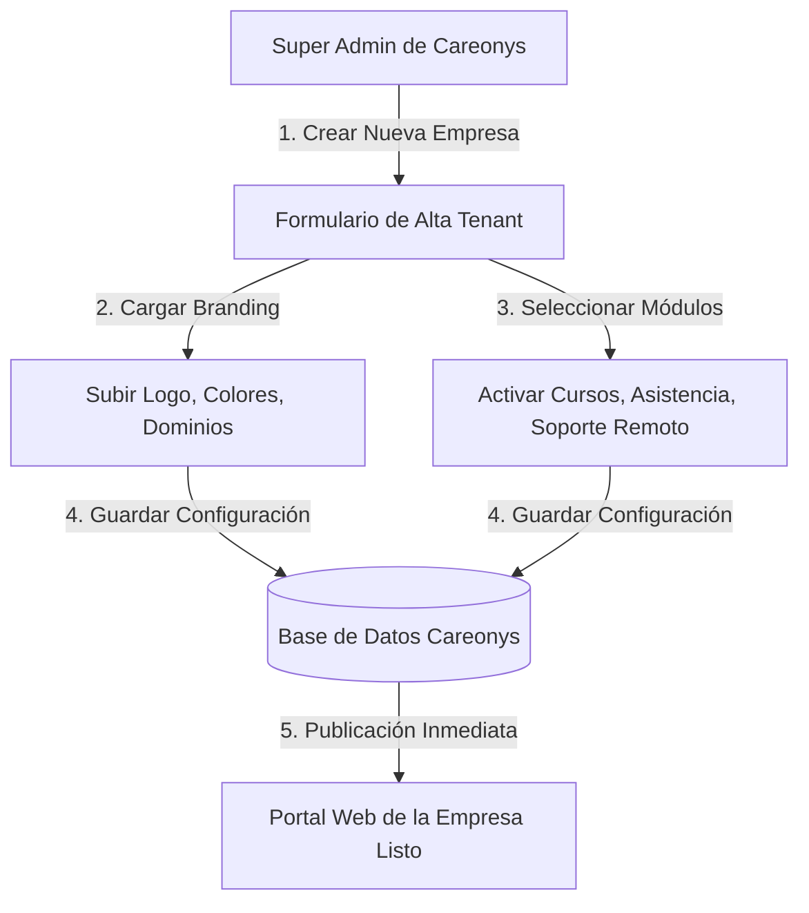

# Arquitectura Multi-Tenant de Careonys: Gestión de Múltiples Empresas Real

Este documento explica cómo funciona y cómo debe estructurarse la plataforma **Careonys** para soportar y dar de alta múltiples empresas licenciatarias reales (Tenants) de manera escalable.

---

## 1. Concepto Fundamental

En un esquema **SaaS Multi-Tenant**, **Careonys** actúa como el núcleo central (Core / Backend / Engine). No se clona ni se crea una carpeta física nueva por cada empresa cliente, sino que el sistema utiliza **un único código base** que adapta su apariencia, reglas y datos según la empresa que está accediendo.

---

## 2. Estrategia de Implementación Técnica

### A. Identificación del Tenant (Routing & Subdominios)
Cada empresa licenciataria accede a través de su propio identificador:
* **Por Subdominio**: `empresaA.careonys.com`, `empresaB.careonys.com`
* **Por Dominio Personalizado**: `www.asistenciaempresaA.com` (apuntando mediante CNAME a Careonys)
* **Por Ruta (desarrollo/demo)**: `app.careonys.com/tenant/empresaA`

### B. Inyección Dinámica de Identidad Visual (Branding System)
Al cargar la aplicación, el frontend consulta a la API de Careonys la configuración de la empresa correspondiente (`tenant_id`) y aplica automáticamente:

1. **Variables de Estilo CSS**:
   ```css
   :root {
     --color-primary: #0056b3;   /* Color primario de la empresa */
     --color-secondary: #00a896; /* Color secundario */
     --font-family: 'Inter', sans-serif;
   }
   ```
2. **Activos de Marca**: Logo de cabecera, favicon, banner de portada e imágenes institucionales.
3. **Diccionario de Terminología (Micro-copy)**:
   * Empresa A prefiere usar: *"Asistentes de Salud"*
   * Empresa B prefiere usar: *"Cuidadores Domiciliarios"*
   * Empresa C prefiere usar: *"Acompañantes Terapéuticos"*

### C. Aislamiento de Datos en Base de Datos (Multi-Tenancy Segura)
En la base de datos (por ejemplo, Supabase / PostgreSQL):
* Todas las tablas principales (`usuarios`, `solicitudes`, `postulaciones`, `cursos`, `perfiles`) contienen la columna `tenant_id`.
* Se implementan políticas **RLS (Row Level Security)** para asegurar que una empresa nunca pueda leer ni escribir datos de otra empresa licenciataria.

---

## 3. Flujo de Alta de una Nueva Empresa (Onboarding Admin)



1. **Paso 1 - Registro**: El Super Admin de Careonys crea la empresa cliente (Ej: "Salud Total S.A.").
2. **Paso 2 - Configuración Visual**: Se cargan sus colores corporativos, logos y términos legales.
3. **Paso 3 - Activación de Módulos**: Se seleccionan los servicios habilitados (Directorio de personal, Solicitud de servicios, Portal de Cursos, Soporte Remoto).
4. **Paso 4 - Publicación**: La empresa recibe sus credenciales de administración y su portal queda 100% operativo en su subdominio o dominio propio.

---

## 4. Beneficios del Esquema Multi-Tenant Único frente a Clonar Carpetas

| Criterio | Clonar Carpetas / Sitios Independientes | Multi-Tenant Único (Careonys) |
| :--- | :--- | :--- |
| **Mantenimiento** | Muy difícil. Cada cambio requiere editar N carpetas. | **Centralizado**. Un solo cambio actualiza a todas las empresas al instante. |
| **Escalabilidad** | Limitada. Cada cliente suma deuda técnica. | **Infinita**. Crear 100 empresas no requiere escribir código nuevo. |
| **Nuevas Funciones** | Hay que copiar y pegar en cada sitio. | Se lanza una función en Careonys y queda disponible para todas las empresas. |
| **Seguridad** | Fragmentada. | Regida por políticas RLS y encriptación centralizada. |
