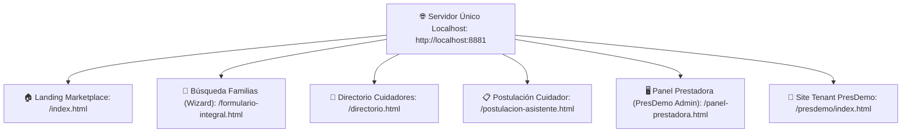

# Arquitectura Unificada de Servidor y Rutas (Careonys SaaS - CeltaTech)

**Documento de Diagnóstico y Corrección de Enrutamiento Localhost**  
**Fecha de Documentación**: 4 de Agosto de 2026  
**Desarrollador del Software**: **CeltaTech**  
**Producto**: **Careonys SaaS** (Módulo Marketplace)  
**Ubicación**: `docs/arquitectura_unificada_localhost.md`  

---

## 1. Diagnóstico del Error de Enrutamiento (Subcarpetas Separadas)

Al intentar montar 4 servidores HTTP distintos apuntando a subcarpetas artificiales (`apps/app-familia`, `apps/app-cuidador`, `apps/panel-prestadora`), se produjeron los siguientes fallos críticos:

1. **Ruptura de Assets Globales (404 Not Found)**:  
   Las subcarpetas no encontraban la hoja de estilos (`css/styles.css`), los logos de la marca (`assets/images/logo_careonys.png`) ni el cliente API (`js/apiClient.js`), rompiendo la interfaz visual.
2. **Navegación Incoherente**:  
   Los formularios y enlaces al hacer clic derivaban a rutas fuera de la raíz del servidor HTTP secundario, generando páginas no encontradas.

---

## 2. Solución Unificada e Integrada en `http://localhost:8881`

Todas las aplicaciones del ecosistema comparten los estilos, recursos gráficos y lógica de API desde la raíz del proyecto `f:\proyectos\Careonys-Marketplace`.

Servidor Activo Único: **`http://localhost:8881`**

---

## 3. Mapa de URLs de Acceso Directo en `http://localhost:8881`

| Rol / Módulo | Funcionalidad | URL en Localhost |
| :--- | :--- | :--- |
| **Público General** | Portal de Inicio Careonys Marketplace | [http://localhost:8881/index.html](http://localhost:8881/index.html) |
| **Familias** | Wizard de Búsqueda de Cuidador de 6 Pasos | [http://localhost:8881/formulario-integral.html](http://localhost:8881/formulario-integral.html) |
| **Familias** | Directorio de Cuidadores Verificados | [http://localhost:8881/directorio.html](http://localhost:8881/directorio.html) |
| **Familias** | Solicitud Rápida de Asistente | [http://localhost:8881/solicitar-asistente.html](http://localhost:8881/solicitar-asistente.html) |
| **Cuidadores** | Postulación de Legajo (DNI, Penales, Títulos) | [http://localhost:8881/postulacion-asistente.html](http://localhost:8881/postulacion-asistente.html) |
| **Cuidadores** | Perfil Detallado y Grilla 7x3 | [http://localhost:8881/perfil.html](http://localhost:8881/perfil.html) |
| **Prestadora (PresDemo)** | Panel Admin para Auditar Legajos y Validar | [http://localhost:8881/panel-prestadora.html](http://localhost:8881/panel-prestadora.html) |
| **Tenant PresDemo** | Portal Multitenant con Marca PresDemo | [http://localhost:8881/presdemo/index.html](http://localhost:8881/presdemo/index.html) |
