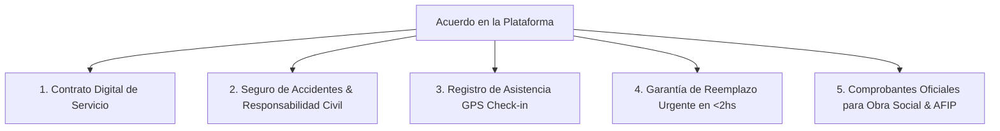

# Control de Contratación y Evitación de Desintermediación en Careonys

Este documento explica cómo opera el **control de contratación** en la referencia `cuidarlos.com` y cómo la plataforma **Careonys Multi-Tenant** implementa mecanismos técnicos, legales y operativos para evitar que las familias y asistentes contraten "por fuera" (desintermediación).

---

## 1. El Desafío de la Desintermediación

En los marketplaces de servicios domiciliarios, existe el riesgo de que la familia y el profesional se conozcan dentro de la app y luego acuerden trabajar por fuera para evitar comisiones.

Tanto **Cuidarlos.com** como **Careonys** resuelven este desafío no prohibiendo el contacto, sino **haciendo que contratar DENTRO de la plataforma sea infinitamente más seguro, rentable y conveniente para ambas partes**.

---

## 2. Los 5 Mecanismos de Control de Contratación (Cómo trabaja Cuidarlos)



### Mecanismo 1: Acuerdo / Contrato Digital de Servicio en la App
* **Cómo funciona**: La contratación no se hace "de palabra". La familia y el asistente firman digitalmente un **Acuerdo de Servicio** dentro de la app que establece:
  * Horarios, días y valor hora acordado.
  * Tareas autorizadas y protocolo en caso de emergencia.
  * Términos de cancelación y preaviso.

### Mecanismo 2: Cobertura de Seguro de Accidentes Personales y Responsabilidad Civil
* **El gran incentivo de retención**:
  * **Dentro de la Plataforma**: Cada hora trabajada incluye cobertura automática de seguro contra accidentes laborales para el asistente e indemnización de responsabilidad civil para la familia.
  * **Por Fuera de la Plataforma**: La familia asume el **100% del riesgo legal y laboral** (juicios por trabajo no registrado, accidentes en la propiedad).

### Mecanismo 3: Control de Asistencia Geolocalizado (GPS Check-in / Check-out)
* El asistente debe marcar **Inicio de Turno** y **Fin de Turno** desde la app móvil.
* El sistema valida las coordenadas GPS frente al domicilio del paciente:
  * Si el asistente no marca llegada a los **15 minutos** de la hora pactada, la app envía una notificación automática al familiar.
  * A los **30 minutos**, salta una alerta al **Gestor del Cuidado** de la licenciataria.

### Mecanismo 4: Garantía de Reemplazo Urgente (<2hs)
* Si el asistente asignado falta por enfermedad o fuerza mayor, la plataforma envía un **asistente de reemplazo verificado en menos de 2 horas**.
* Este beneficio es **exclusivo para contrataciones registradas y activas en el sistema**.

### Mecanismo 5: Liquidación, Facturación AFIP y Reintegros de Obra Social
* La plataforma emite automáticamente la **factura electrónica oficial** y los resúmenes de bitácora médica firmada.
* Esto permite a las familias **deducir el gasto en ganancias o solicitar el reintegro total/parcial en OSDE, Swiss Medical, Galeno o PAMI**. Si contratan por fuera sin factura, pierden este beneficio económico.

---

## 3. Flujo de Pago y Custodia (Escrow System)

```
1. Familia Paga a Careonys / Licenciataria ➔ 2. Fondos retenidos en Custodia (Escrow)
                                             ➔ 3. Asistente marca Asistencia GPS + Bitácora
                                             ➔ 4. Liberación de Honorarios al Asistente + Factura a Familia
```

1. **Cobro Automático**: La familia ingresa su tarjeta o débito automático.
2. **Validación de Horas**: Las horas se liquidan **únicamente contra los marcajes GPS reales y aprobados por la familia**.
3. **Protección de Honorarios**: El asistente tiene la garantía de que cobrará en fecha sin depender de que la familia le pague en efectivo.
