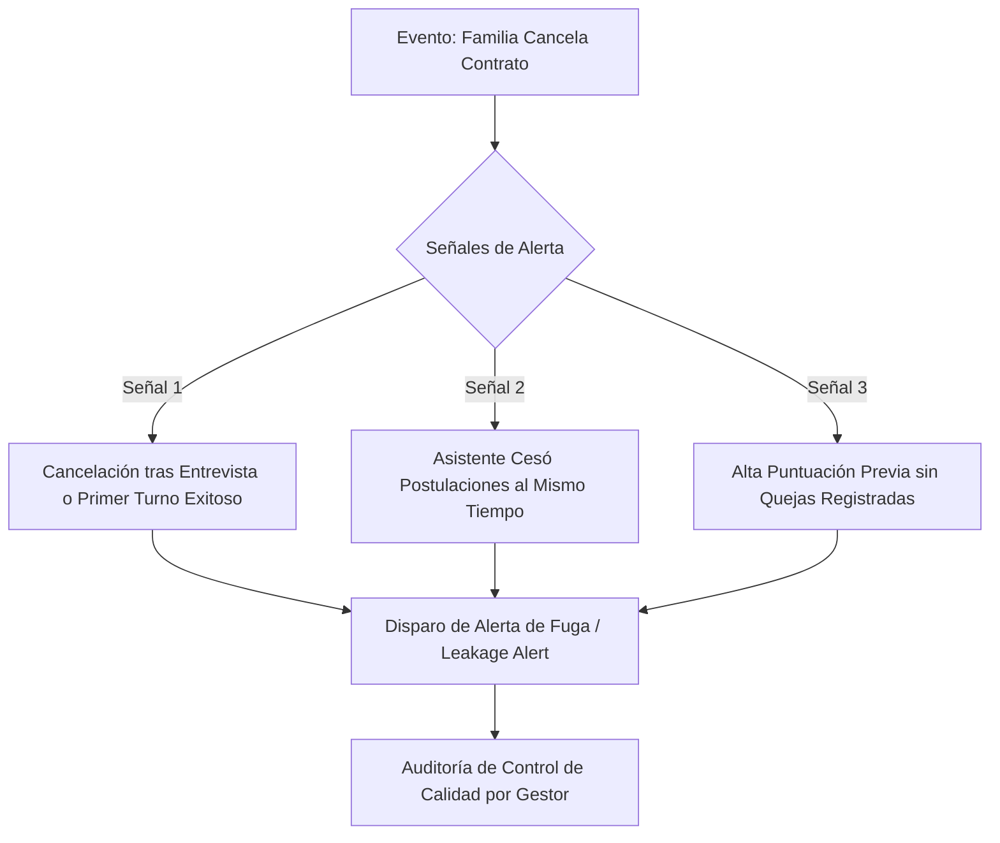

# Detección de Fuga de Clientes y Prevención de Desintermediación en Careonys

Este documento explica cómo el software **Careonys** y las empresas licenciatarias (**PresDemo / Tenants**) detectan, previenen, sancionan y monetizan los intentos de una familia de cancelar el contrato en la app para contratar "por fuera" a un asistente conocido en la plataforma.

---

## 1. Patrones de Detección en el Sistema (Algoritmo de Fuga)

### Señal 1: Cancelación Inmediata tras Interacción Exitosa
Si una familia agenda una entrevista o un turno de prueba con la Asistente A, le otorga una alta calificación o chatea extensamente, e inmediatamente cancela la búsqueda alegando *"Ya no necesito el servicio"*, el algoritmo marca el caso como **Riesgo Alto de Fuga (High Leakage Risk)**.

### Señal 2: Cruce de Inactividad del Asistente
El sistema analiza el comportamiento del profesional: si la Asistente A solía postularse a 5 búsquedas por semana y, tras la cancelación de la Familia X, deja de postularse por completo sin haber registrado otro trabajo en la app, el sistema detecta la **Coincidencia Cruzada de Contratación Irregular**.

### Señal 3: Auditoría Telefónica de Control de Calidad (Outbound Call)
Cuando una familia cancela un aviso, el equipo de Atención al Cliente / Gestor del Cuidado realiza un llamado de auditoría dentro de las 48 horas:
> *"Hola Sra. Pérez, vemos que canceló la búsqueda con la asistente Carmen. Para nuestro control de calidad, ¿el servicio no cumplió sus expectativas o ingresó a su familiar en una residencia?"*
Esta auditoría identifica la mayoría de los casos de contratación no declarada.

---

## 2. Herramientas de Desincentivo y Penalizaciones

### A. Bloqueo Permanente y Pérdida de Reputación del Asistente
* La asistente que acepta trabajar "en negro" por fuera con un cliente de la plataforma **es suspendida y dada de baja definitivamente de la red**.
* **Impacto**: El profesional pierde todo su historial de calificaciones, sus Puntos Reputacionales (`Bronce` $\rightarrow$ `Plata` $\rightarrow$ `Oro`) y el acceso a decenas de futuras oportunidades de trabajo en su zona.

### B. Cláusula de Penalidad Contractual (Buyout Fee)
* En los Términos y Condiciones, se establece que contratar por fuera a un profesional presentado por la plataforma constituye un **incumplimiento contractual**.
* Se establece un **Fee de Contratación Directa (Buyout Fee)** (ejemplo: 2 meses de honorarios) más penalidades legales si se omite la declaración.

### C. Desprotección Absoluta de la Familia
Al cancelar en la app, la familia pierde automáticamente:
1. **Seguro de Accidentes Personales & Responsabilidad Civil**: Si el asistente se lesiona en la vivienda o sufre un accidente, la familia asume el **100% de la responsabilidad laboral y juicio directo**.
2. **Garantía de Reemplazo Urgente (<2hs)**: Si la asistente falta el lunes, la familia se queda sin cobertura.
3. **Facturación AFIP y Reintegros de Obra Social**: Se invalida la emisión de comprobantes para recuperar el dinero en OSDE, Swiss Medical, PAMI o deducir de Ganancias.

---

## 3. Estrategia de Monetización de Fugas ("Compra de Legajo")

En lugar de pelear contra la desintermediación a ciegas, las plataformas modernas la monetizan:

* **Opción "Pase a Contratación Directa / Nómina Familiar"**:
  * Si la familia insiste en contratar en forma directa al asistente, la plataforma le ofrece la **Compra del Legajo Acreditado** por un pago único de intermediación (ej: $ 50.000 ARS).
  * La plataforma le entrega el expediente verificado (DNI, antecedentes penales, psicotécnico) y emite la factura del fee de selección, logrando monetizar el evento legalmente.
