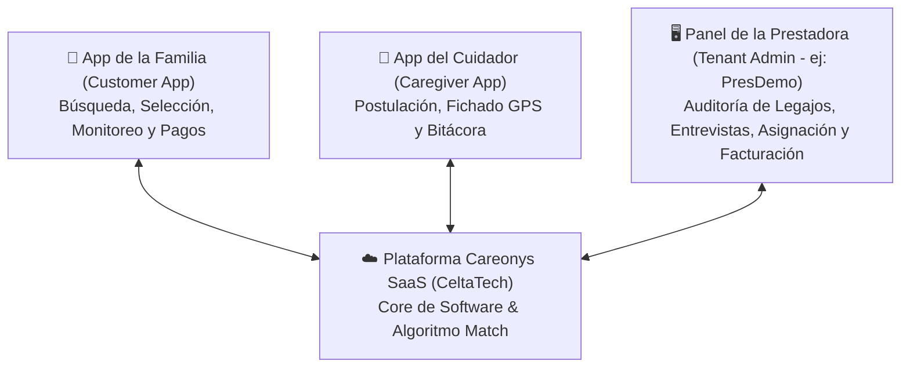
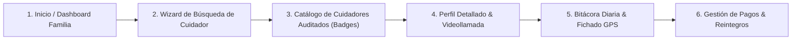
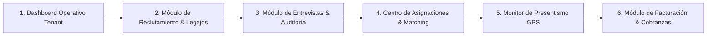

# Especificación de Arquitectura y Funcionamiento: App de la Familia & Panel de la Prestadora (Careonys SaaS - CeltaTech)

**Documento de Especificación de Experiencia de Usuario (UX), Flujos Operativos y Pantallas**  
**Fecha de Documentación**: 4 de Agosto de 2026  
**Desarrollador del Software**: **CeltaTech**  
**Producto**: **Careonys SaaS** (Módulo Marketplace)  
**Ubicación**: `docs/especificacion_apps_familia_y_prestadora_careonys.md`  

---

## 1. Visión General de la Ecosistema Tripartito Careonys

---

## 2. App de la Familia (Customer App)

La aplicación de la Familia está enfocada en **transparencia, simplicidad y tranquilidad** para el cuidado del adulto mayor.

### 📱 Pantallas y Funcionalidades Clave de la Familia:

#### Pantalla F1: Dashboard Principal de la Familia
* **Estado del Familiar Asistido**: Nombre del paciente (ej: *"Abuela Rosa"*), ubicación en tiempo real y cuidador asignado en turno.
* **Acceso Rápido**: *Buscar Cuidador*, *Solicitar Reemplazo Urgente (<2hs)*, *Ver Bitácora Diaria*, *Agendar Videollamada con Gestor*.

#### Pantalla F2: Wizard de Publicación de Búsqueda (6 Pasos)
* **Paso 1**: Datos del paciente (edad, diagnóstico, nivel de movilidad).
* **Paso 2**: Tareas requeridas (higiene, administración de medicación, cocina, acompañamiento a turnos).
* **Paso 3**: Modalidad de contratación (*Por horas*, *Con retiro*, *Cama adentro / Sin retiro*, *Guardias fin de semana*).
* **Paso 4**: Horarios y días requeridos (Grilla 7x3).
* **Paso 5**: Preferencia de perfil (*Cuidador Domiciliario*, *Enfermero*, *Acompañante Terapéutico*).
* **Paso 6**: Resumen y publicación + Aceptación de [Términos y Condiciones para Familias](file:///f:/proyectos/Careonys-Marketplace/docs/terminos_y_condiciones_familias.md).

#### Pantalla F3: Catálogo de Cuidadores Verificados
* **Filtros Avanzados**: Filtrado por especialidad (Alzheimer, Parkinson, ACV), badges de verificación y coincidencia por algoritmo (% Match).
* **Badges Visibles**: 🟢 **Validado por la Prestadora (ej: PresDemo)**, 🛡️ *DNI Validado*, 📋 *Penales OK*, 📜 *Título Gerontológico*.

#### Pantalla F4: Perfil del Profesional & Videollamada
* Muestra video de presentación de 30 segundos, experiencia declarada, mapa de cobertura y valorizaciones de otros familiares.
* Botón **"Iniciar Videollamada de Diagnóstico"** o **"Contactar Vía Chat"**.

#### Pantalla F5: Bitácora Diaria de Cuidado & Presentismo GPS
* **Control de Presentismo**: Confirmación de entrada/salida (Clock-in / Clock-out) del cuidador en el domicilio con geolocalización GPS.
* **Bitácora Médica Diaria**: Registro de presión arterial, glucemia, medicamentos administrados a tiempo y reporte de estado de ánimo.

#### Pantalla F6: Gestión de Pagos, Membresías y Facturación
* Historial de comprobantes de Facturación Electrónica AFIP para tramitar el **reintegro con Obras Sociales / Prepagas**.
* Administración de membresía mensual o packs de búsqueda activa.

---

## 3. Panel de la Prestadora Cliente (Tenant Admin - ej: PresDemo)

El Panel de la Prestadora es la **central de inteligencia y control operativo** de la empresa cliente que adquiere el SaaS Careonys.

### 🖥️ Pantallas y Funcionalidades del Panel de la Prestadora:

#### Pantalla P1: Dashboard de Control Operativo
* **Métricas en Tiempo Real**: Cuidadores activos en turno, búsquedas de familias pendientes de asignación, alertas de ausentismo o tardanzas.
* **Alertas Críticas**: Botón de activación de **Reemplazos Urgentes (<2hs)**.

#### Pantalla P2: Reclutamiento & Gestión de Legajos Digitales ("En Revisión")
* **Bandeja de Entrada de Aspirantes**: Muestra todas las postulaciones ingresadas desde el Marketplace en estado 🔴 *"En Revisión"*.
* **Visor de Legajos**: Visualización en pantalla dividida de:
  - Foto de DNI (Frente/Dorso) enviada a validación RENAPER.
  - Certificado de Antecedentes Penales.
  - Títulos, Matrículas y Certificados de Formación.

#### Pantalla P3: Módulo de Entrevistas & Otorgamiento de Aval
* **Agenda de Entrevistas**: Programación de entrevistas presenciales o por Videollamada integrada (Jitsi/8x8).
* **Evaluación Psicotécnica y Gerontológica**: Formulario de calificación interna del entrevistador de la prestadora.
* **Botón de Aprobación**: Al hacer clic en *"Aprobar y Validar"*, el sistema cambia el estado del cuidador a 🟢 **"Validado por Prestadora"** y lo habilita en el catálogo activo.

#### Pantalla P4: Centro de Matching & Asignación de Cuidador
* El algoritmo de Careonys sugiere los 5 cuidadores mejor calificados de la prestadora para la búsqueda específica de una familia.
* La prestadora confirma la asignación y notifica a ambas partes.

#### Pantalla P5: Monitor de Cumplimiento GPS & Bitácoras
* Mapa en tiempo real de los cuidadores en servicio en los domicilios de los clientes.
* Alerta automática si un cuidador no realiza el fichado GPS (Clock-in) 15 minutos antes o después de la hora de inicio acordada.

#### Pantalla P6: Gestión de Facturación B2B & B2C
* Emisión masiva de facturas para familias.
* Reportes de horas trabajadas para liquidación de servicios a cuidadores.
