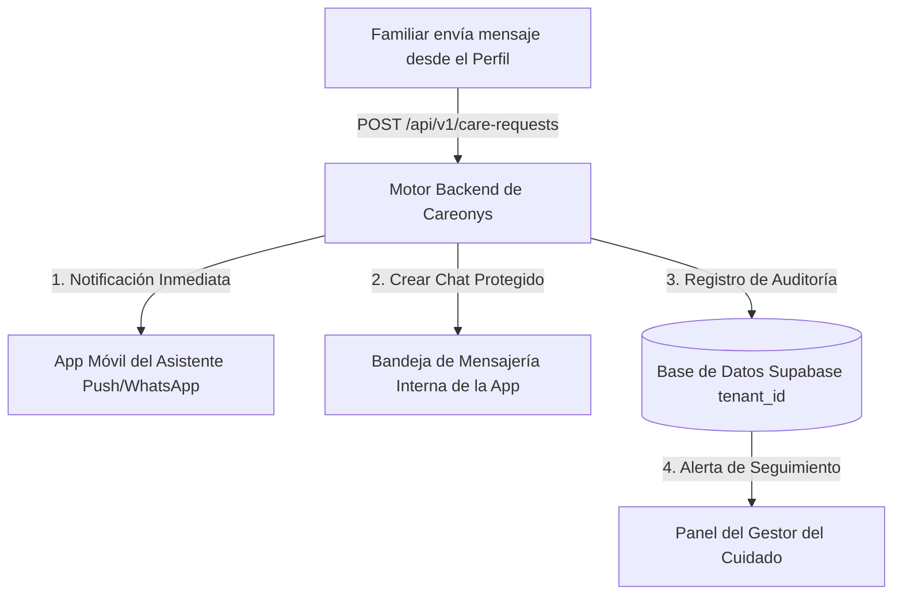

# Flujo de Mensajería: ¿A dónde se envía el mensaje al contactar a un asistente?

Este documento explica el destino técnico y operativo de los mensajes cuando un familiar contacta a un profesional en la plataforma **Careonys Multi-Tenant**.

---

## 1. Funcionamiento en el Frontend Actual (Prototipo Web)
En la interfaz actual ([`perfil.html`](file:///f:/proyectos/Careonys-Marketplace/perfil.html#contact-form) y [`directorio.html`](file:///f:/proyectos/Careonys-Marketplace/directorio.html)):
- Al presionar **"Enviar Mensaje"**, el script en JavaScript simula el envío local, limpia el formulario y muestra la confirmación de éxito: `✓ ¡Mensaje enviado! Recibirás una respuesta a la brevedad.`

---

## 2. Flujo Real en la Arquitectura de Backend (Careonys Core + Supabase)

Cuando la plataforma se conecta con la API de Careonys (`/api/v1/care-requests`), el mensaje se procesa y se envía simultáneamente a **3 destinos**:

### Destino A: App Móvil del Asistente (Notificación Push & WhatsApp)
* El asistente recibe una **Notificación Push** instantánea en su teléfono inteligente:
  > *"Tenés una nueva consulta de la familia Gómez sobre Cuidado Domiciliario en Palermo."*
* Si el asistente tiene activadas las alertas SMS/WhatsApp, recibe un enlace seguro para abrir la app.

### Destino B: Bandeja de Mensajería Interna (Chat Seguro de Careonys)
* Se inicia una conversación en el **Chat Interno** de la aplicación.
* Por seguridad y privacidad, los teléfonos personales pueden permanecer enmascarados hasta que la familia y el asistente acuerden una entrevista inicial.

### Destino C: Panel de Administración de la Licenciataria (`tenant_id`)
* El mensaje se almacena en PostgreSQL bajo la tabla `careonys.care_requests` asociado al `tenant_id` de la empresa licenciataria (ej. `presdemo`).
* El **Gestor del Cuidado (Care Manager)** de la empresa supervisa la consulta. Si el asistente no responde dentro de las **2 horas**, el sistema alerta al Gestor para ofrecerle a la familia un asistente alternativo o activar la **Garantía de Reemplazo Urgente**.
