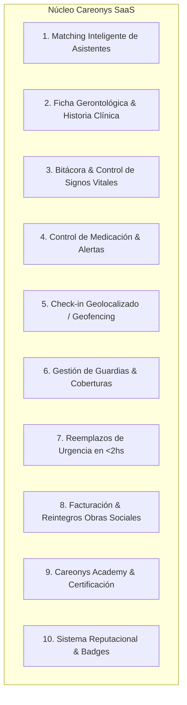

# Investigación Profunda de Cuidarlos.com y Mapa de Funcionalidades para Careonys SaaS

Este documento contiene la investigación en profundidad sobre el modelo de servicios, aplicación móvil, plataforma web y procesos de negocio del ecosistema de referencia `cuidarlos.com`, estableciendo la matriz completa de características a incorporar en el software **Careonys Multi-Tenant**.

---

## 1. Matriz Integral de Módulos y Funcionalidades (Cuidarlos vs Careonys)

---

## 2. Desglose Detallado de Cada Módulo

### 1. Matching Inteligente de Asistentes (Smart Matching)
- **Concepto**: Algoritmo de filtrado que cruza las necesidades de la familia (patología, edad, zona, presupuesto) con los atributos verificados de los asistentes.
- **Implementación Careonys**: Widget de coincidencia en porcentaje (ej: *"98% de compatibilidad para cuidado de Alzheimer en CABA"*) en [directorio.html](file:///f:/proyectos/Careonys-Marketplace/directorio.html).

### 2. Ficha Gerontológica e Historia Clínica Digital
- **Concepto**: Expediente médico completo del paciente accesible para la familia y el asistente autorizado.
- **Campos**:
  - Datos clínicos (Diagnóstico principal, alergias, grupo sanguíneo, limitaciones físicas).
  - Contactos de emergencia priorizados (Familiar a cargo, médico de cabecera, servicio de ambulancia privado).
  - Datos de Cobertura Médica (Obra Social / Prepaga, N° de afiliado).
- **Implementación Careonys**: Componente visual de Ficha Médica en [perfil.html](file:///f:/proyectos/Careonys-Marketplace/perfil.html).

### 3. Bitácora Digital & Control de Signos Vitales (Daily Care Log)
- **Concepto**: Reporte diario que el asistente completa turno a turno desde su teléfono.
- **Métricas**:
  - Presión arterial (sistólica/diastólica).
  - Frecuencia cardíaca y saturación de oxígeno.
  - Glucemia en sangre.
  - Registro de evacuaciones, apetito e hidratación.
  - Estado de ánimo (Escala de caritas / 1 a 5).

### 4. Gestor de Medicamentos con Registro Fotográfico (Pill Tracker)
- **Concepto**: Planilla de dosis con horarios estrictos para evitar omisiones.
- **Funcionalidad**: Alerta al celular de la familia cuando se administra cada remedio con confirmación de dosis y foto del blíster.

### 5. Check-in Geolocalizado (Geofencing Presence Control)
- **Concepto**: Verificación de puntualidad y asistencia real del profesional en el hogar del paciente.
- **Funcionalidad**: La app valida las coordenadas GPS del teléfono al iniciar y finalizar el turno dentro de un radio de 50 metros del domicilio.

### 6. Matriz de Guardias y Modalidades de Contratación
- **Tipos de Cuidado**:
  1. *Cuidado Domiciliario Diurno* (Por horas / Jornada fija).
  2. *Velada Nocturna / Cuidado del Sueño* (Monitoreo nocturno).
  3. *Acompañamiento en Sanatorio / Hospital* (Asistencia post-quirúrgica en internación).
  4. *Cuidado Cama Adentro / Conviviente* (Asistencia 24hs con francos rotativos).
  5. *Guardias de Fin de Semana y Feriados*.

### 7. Facturación, Recibos y Reintegros en Obras Sociales
- **Concepto**: Asesoramiento y emisión de comprobantes para que la familia pueda solicitar el reintegro de gastos de cuidado ante su Obra Social (OSDE, Swiss Medical, Galeno, PAMI, etc.) o presentar como deducción impositiva.

### 8. Sistema de Verificación de 4 Niveles y Badges de Seguridad
- **Nivel 1**: DNI & Identidad Validada vía RENAPER.
- **Nivel 2**: Certificado de Antecedentes Penales (Registro Nacional de Reincidencia).
- **Nivel 3**: Referencias Laborales de empleadores anteriores Auditadas Telefónicamente.
- **Nivel 4**: Matrícula o Título Gerontológico Acreditado (AMIA, Universidad, Ministerio de Salud).

---

## 3. Plan de Integración en las Vistas HTML del Proyecto

1. **[directorio.html](file:///f:/proyectos/Careonys-Marketplace/directorio.html)**:
   - Incorporar Badges de Verificación de 4 Niveles en las tarjetas de perfiles.
   - Añadir indicador de *Porcentaje de Match Inteligente*.
2. **[perfil.html](file:///f:/proyectos/Careonys-Marketplace/perfil.html)**:
   - Incorporar el módulo interactivo de **Ficha Gerontológica & Bitácora de Signos Vitales**.
3. **[solicitar-asistente.html](file:///f:/proyectos/Careonys-Marketplace/solicitar-asistente.html)**:
   - Añadir la sección de **Calculadora de Reintegros de Obra Social y Facturación**.
