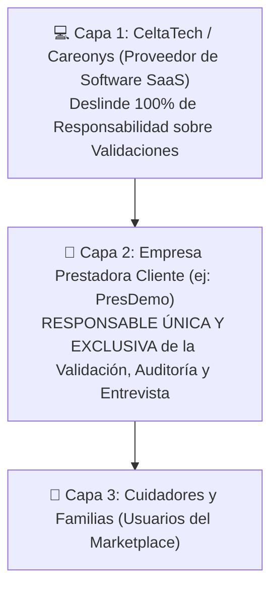

# Términos, Condiciones de Uso y Exención Legal del Software Careonys Marketplace (CeltaTech SaaS)

**Deslinde Legal de Responsabilidad y Roles de Validación**  
**Fecha de Actualización**: 4 de Agosto de 2026  
**Desarrollador del Software**: **CeltaTech**  
**Producto**: **Careonys** (Módulo Marketplace SaaS)  
**Ubicación**: `docs/legales_y_terminos_careonys_marketplace.md`  

---

## ⚠️ CLÁUSULA MÁSTER DE DESLINDE DE RESPONSABILIDAD

> **DESLINDE DE VALIDACIÓN Y RESPONSABILIDAD OPERATIVA**:  
> **Careonys** (y su empresa desarrolladora **CeltaTech**) es un proveedor **exclusivamente tecnológico** que otorga licencias de uso de software en modalidad SaaS (Software as a Service).  
> **Careonys NO valida, NO audita, NO entrevista, NO califica, NO garantiza ni asume responsabilidad legal u operativa alguna** sobre la veracidad de los datos, legajos o antecedentes de los cuidadores, ni sobre el desempeño, conductas o servicios prestados por los asistentes o por las empresas prestadoras.  
> **La validación y la selección son responsabilidad 100% EXCLUSIVA de la Empresa Prestadora Cliente (ej: PresDemo)** que utiliza el software para administrar su propio plantel.

---

## 1. Arquitectura Legal en Tres Capas

---

## 2. Ajuste de Terminología e Insignias (Badges)

Para reflejar fielmente la exención legal de Careonys y la responsabilidad directa de la prestadora:

* ❌ **Denominación Invalidad**: *"Validado por Careonys"* (DEPRECADA, pues sugeriría responsabilidad de Careonys).
* 🟢 **Denominación Oficial**: **"Validado por Prestadora"** (o *"Validado por PresDemo"* en el tenant correspondiente).

---

## 3. Desglose de Responsabilidades

| Actor | Responsabilidad Legal | ¿Valida Cuidadores? |
| :--- | :--- | :--- |
| **CeltaTech / Careonys** | Proveer la disponibilidad del servidor, seguridad de datos del software e interfaz UI/UX. | **NO**. Careonys es neutral y no valida ni audita a nadie. |
| **Empresa Prestadora (ej: PresDemo)** | Auditar legajos, revisar DNI/Penales, hacer entrevistas, otorgar el aval institucional e incorporar al plantel activo. | **SÍ (100% Responsabilidad Exclusiva)**. |
| **Cuidador** | Declarar información verídica y prestar el servicio bajo las pautas acordadas con la prestadora/familia. | N/A (Declara datos). |

---

## 4. Archivos de Resguardo

- `docs/cuidarlos_terminos_legales.txt` (Textos brutos del competidor)
- `docs/analisis_exhaustivo_fotos_app_cuidarlos.md` (Análisis del competidor)
- `docs/arquitectura_corporativa_celtatech_careonys.md` (Definición del negocio B2B SaaS)
