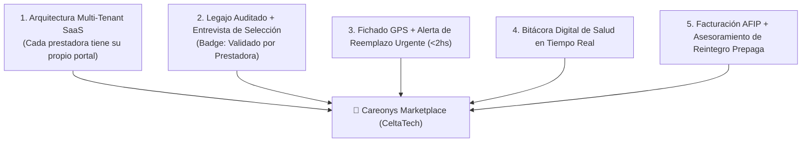

# Matriz Comparativa: Cuidarlos.com vs. Innovaciones y Mejoras de Careonys Marketplace (CeltaTech SaaS)

**Documento de Análisis Competitivo e Innovaciones de Producto**  
**Fecha de Documentación**: 4 de Agosto de 2026  
**Desarrollador del Software**: **CeltaTech**  
**Producto**: **Careonys SaaS** (Módulo Marketplace)  
**Ubicación**: `docs/matriz_comparativa_cuidarlos_vs_careonys_mejoras.md`  

---

## 1. Cuadro Comparativo Frente a Cuidarlos

| Funcionalidad / Módulo | Competidor: Cuidarlos.com | Producto Superior: Careonys Marketplace | Ventaja Competitiva Careonys |
| :--- | :--- | :--- | :--- |
| **Modelo de Negocio** | App B2C rígida y cerrada auto-gestionada (Clasificados). | **SaaS Multi-Tenant B2B2C**: La empresa prestadora (ej: PresDemo) opera su propio catálogo con marca propia. | Escalabilidad de ventas B2B a múltiples prestadoras de salud. |
| **Proceso de Selección** | Registro directo en app; el cuidador queda visible sin entrevista obligatoria previa. | **Filtro de Auditoría de Prestadora**: El cuidador queda 🔴 *"En Revisión"* hasta ser auditado y entrevistado por la prestadora. | 100% Garantía de seguridad para las familias. |
| **Badges de Confianza** | Iconos genéricos de la app. | Distintivo destacado 🟢 **Validado por la Prestadora** + DNI (RENAPER) + Penales + Matrícula + Ref. Comprobadas. | Transparencia total sin comprometer legalmente a Careonys. |
| **Control de Presentismo** | No tiene seguimiento GPS de entradas/salidas en tiempo real. | **Fichado GPS en Domicilio (Clock-in / Clock-out)** con alerta automática por tardanzas (>15 min). | Tranquilidad absoluta para el familiar a distancia. |
| **Reemplazo Urgente** | Sin garantía automatizada de sustitución. | **Alerta de Reemplazo Urgente (<2hs)**: Despacho automático de cuidador suplente del plantel de la prestadora. | Cobertura garantizada 24/7 sin vacíos de cuidado. |
| **Bitácora Médica Diaria** | Notas básicas en chat de la app. | **Bitácora Digital de Salud**: Registro de signos vitales (presión, glucemia), medicación administrada y estado de ánimo. | Seguimiento médico estructurado. |
| **Facturación y Reintegros** | Cobro directo de packs en dólares (U$S 13/15). | **Gestión de Reintegro Oficial**: Emisión de comprobantes AFIP para Obras Sociales/Prepagas (OSDE, Swiss Medical, PAMI). | Accesibilidad económica facilitando el reintegro. |
| **Videollamada de Diagnóstico** | No disponible en la plataforma. | **Videollamada Integrada (Jitsi/8x8)** para entrevistas de diagnóstico con el Gestor de Cuidado. | Evaluación humanizada sin traslados. |

---

## 2. Las 5 Mejoras Clave Incorporadas en Careonys

1. **Arquitectura Multi-Tenant SaaS**: Careonys le permite a cualquier empresa de cuidado (PresDemo y futuras agencias cliente) revender el servicio con su propia marca y administrar su propio plantel activo.
2. **Filtro de Inserción al Plantel**: A diferencia de la bolsa de trabajo abierta de Cuidarlos, en Careonys el cuidador no se publica solo; debe ser entrevistado y verificado por la prestadora.
3. **Fichado GPS y Alerta de Reemplazo Inmediato**: Si un cuidador no ficha en el domicilio a tiempo, el sistema dispara automáticamente una alerta a la prestadora para enviar un reemplazo en menos de 2 horas.
4. **Bitácora Médica Digital**: La familia no solo ve si el cuidador llegó, sino que recibe en tiempo real el registro de presión, azúcar, medicación administrada y fotos de la rutina diaria.
5. **Reintegro ante Obra Social y Facturación Oficial**: Careonys facilita los comprobantes legales (Factura A/B de AFIP) para que la familia recupere el dinero a través de su cobertura médica.
