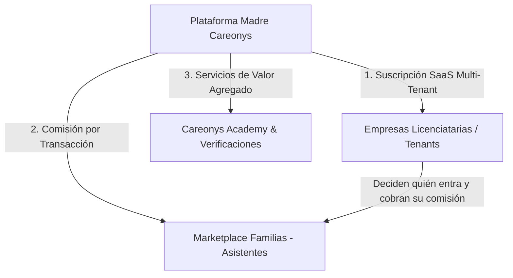

# Modelo de Negocios de Careonys: Plataforma SaaS B2B2C Multi-Tenant

> [!WARNING]
> **Material de diseño de lo comercial de CeltaTech.** Revisado el 2026-08-23.
>
> Acá está el modelo con el que se vende el producto: planes, comisiones y servicios pagos. Eso es
> del nivel de CeltaTech y vive en su panel, no adentro del producto: lo fija `../../CLAUDE.md`,
> «CeltaTech no sabe qué hacen los productos por dentro». Se conserva como material de diseño, no
> como especificación de nada.
>
> **Nada de esto se construye en este proyecto**: ninguna tabla de precios ni de planes, y ningún
> nombre de plan escrito en el código. Detalle en `docs/ALCANCE.md` §4.

Este documento define la arquitectura estratégica de negocios, modelos de monetización, propuesta de valor y unidad económica (*Unit Economics*) para la plataforma **Careonys**.

---

## 1. Visión del Modelo de Negocios

**Careonys** opera bajo un esquema híbrido **B2B2C (Business-to-Business-to-Consumer) / SaaS Multi-Tenant**:

1. **B2B (Software SaaS)**: Se comercializa la infraestructura tecnológica a empresas licenciatarias, franquicias o entidades de salud (*Tenants*) para que operen sus redes de atención.
2. **B2C (Marketplace de Cuidado)**: Conecta directamente a familias con asistentes calificados, monetizando por comisión de servicio y funciones premium.

---

## 2. Las 3 Fuentes Principales de Ingresos (Streams de Monetización)

### Stream 1: Suscripciones SaaS B2B (Licenciamiento Multi-Tenant)
Cobro mensual o anual recurrente (MRR/ARR) a las empresas que utilizan el software Careonys con su propia marca:

| Nivel de Plan | Descripción y Alcance | Modelo de Cobro |
| :--- | :--- | :--- |
| **Plan Starter** | Hasta 50 asistentes y 100 familias activas. Dominio compartido (`tenant.careonys.com`). | **Cuota Fija Mensual** |
| **Plan Growth / Pro** | Asistentes ilimitados, dominio propio personalizado, Gestor del Cuidado y módulo de reintegros. | **Cuota Fija + Fee por Asistente Activo** |
| **Plan Enterprise** | Marca Blanca total, integración API con Obras Sociales / Prepagas, soporte 24/7 y SLA garantizado. | **Contrato Anual a Medida** |

---

### Stream 2: Comisiones por Transacción en el Marketplace (Take Rate)
* **Comisión por Servicio Gestionado (10% a 15%)**: comisión sobre el valor del servicio que acuerdan la Familia y el Asistente. **El producto no interviene en ese cobro**: no guarda el contrato, ni el precio acordado, ni las horas, y no tiene pasarela de pagos (`CLAUDE.md:43-48`). Lo único que registra es el contacto —quién contactó a quién, por cuál de los dos caminos y cuándo—, que es el hecho por el que la Prestadora cobra (`CLAUDE.md:47-48`). Sobre qué valor y por qué medio se cobra ese porcentaje es una definición comercial de CeltaTech, y no sale de este producto.
* **Fee de Selección / Match Exitoso**: Cargo fijo por la vinculación directa entre una familia y un asistente de jornada completa.

---

### Stream 3: Servicios de Valor Agregado (Value-Added Services)

1. **Careonys Academy (Educación & Certificaciones)**:
   * Venta de cursos de formación continua para asistentes (Alzheimer, Parkinson, RCP, Enfermería).
   * Cobro por rendir exámenes de validación que otorgan insignias reputacionales (`BRONCE` $\rightarrow$ `PLATA` $\rightarrow$ `ORO`).
2. **Verificación Premium de Perfiles (Audit Badge)**:
   * Cobro por la auditoría de antecedentes penales reincidencia, validación RENAPER y chequeo telefónico de referencias.
3. **Membresía de Teleasistencia & Acompañamiento Familiar**:
   * Suscripción mensual para familias que incluye la asignación del **Gestor del Cuidado**, supervisión semanal y contención psicológica.

---

## 3. Ventajas Competitivas y Escalabilidad

* **Margen Bruto SaaS Elevado (>80%)**: Al ser una arquitectura Multi-Tenant única, el costo marginal de sumar una nueva empresa cliente es cercano a cero.
* **Efecto de Red (Network Effect)**: A mayor cantidad de asistentes calificados y verificados en la base global de Careonys, mayor es el valor que reciben las empresas licenciatarias.
* **Desacoplamiento de Marca**: El software permite que cualquier licenciatario opere bajo su propio nombre comercial (ej. *PresDemo*, *Salud Domiciliaria*), mientras Careonys actúa como el motor tecnológico maduro (*Powered by Careonys*).
