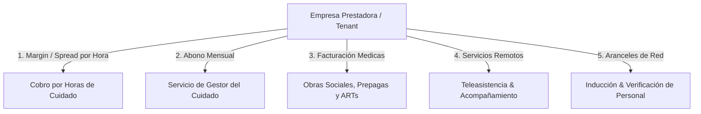

# Modelo de Negocios de la Empresa Prestadora / Licenciataria (Tenant)

Este documento detalla el esquema comercial, fuentes de ingresos, estructura de costos y márgenes de ganancia de la **Empresa Prestadora / Licenciataria** (ej. *Sendler Group / PresDemo*) que opera la plataforma sobre la infraestructura de **Careonys**.

---

## 1. ¿Qué es la Empresa Prestadora?

La **Prestadora** es la empresa cliente o franquiciada que adquiere la licencia de Careonys para operar el negocio de asistencia y cuidado de personas en su región o nicho de mercado.

A diferencia de Careonys (que vende el software SaaS), la **Prestadora vende el servicio final de cuidado y gestión a las familias y entidades de salud**.

---

## 2. Las 5 Fuentes de Ingresos de la Prestadora (Monetización)



### 1. Margen de Intermediación sobre la Hora de Cuidado (Spread Horario)
Es la fuente principal de ingresos recurrentes de la prestadora:
* **Precio cobrado a la Familia**: `$ 3.500 ARS / hora`
* **Pago al Asistente / Cuidador**: `$ 2.500 ARS / hora`
* **Margen Bruto de la Prestadora**: **`$ 1.000 ARS / hora` (28.5% de margen)**
* *Ejemplo*: Con una red activa de 50 asistentes trabajando 160 hs/mes (8.000 hs totales), la prestadora genera **$ 8.000.000 ARS de Margen Bruto mensual** solo por intermediación.

### 2. Abono Mensual por Gestión Gerontológica & Garantía de Reemplazo
Las familias pagan un abono fijo mensual (ej. **$ 25.000 a $ 45.000 ARS/mes**) por acceder a:
* Asignación de un **Gestor del Cuidado** dedicado.
* Informes diarios de bitácora y signos vitales en tiempo real.
* **Garantía de Reemplazo Urgente en <2hs** si el asistente habitual falta.

### 3. Facturación a Obras Sociales, Prepagas y ARTs (Gestion de Reintegros)
La prestadora atiende a familias con cobertura médica (OSDE, Swiss Medical, Galeno, PAMI):
* Factura el valor del módulo de asistencia gerontológica oficial.
* Retiene una **comisión de gestoría del 10% al 15%** por tramitar el expediente de reintegro o amparo de salud.

### 4. Venta de Servicios de Teleasistencia & Acompañamiento Remoto
Paquetes de contención psicológica y apoyo emocional online para la "familia cuidadora" para prevenir el agotamiento o *burnout*.

### 5. Arancel de Registro e Inducción de Profesionales
Cobro de una tasa inicial a los asistentes que se incorporan a su red privada por:
* Proceso de auditoría de antecedentes penales y verificación de referencias.
* Inducción a los protocolos de la empresa y kit de credenciales/uniforme.

---

## 3. Cuenta de Resultados Simulada (P&L de la Prestadora)

```
  Ingresos Totales por Servicios y Cuotas:       $ 28.000.000 ARS
- Costo Directo (Honorarios a Asistentes):      $ 20.000.000 ARS
-----------------------------------------------------------------
= MARGEN BRUTO OPERATIVO:                        $  8.000.000 ARS (28.5%)

- Canon Licencia SaaS a Careonys:               $    800.000 ARS (Suscripción/Fee)
- Gastos de Marketing Local & Captación:        $  1.200.000 ARS
- Equipo Administrativo y Gestor Local:         $  2.500.000 ARS
-----------------------------------------------------------------
= GANANCIA NETA MENSUAL (EBITDA):                $  3.500.000 ARS (12.5% Neto)
```

---

## 4. Resumen de Ventajas para la Prestadora

* **Negocio de Alta Recurrencia**: El cuidado de un adulto mayor es un servicio continuo (meses o años), lo que garantiza ingresos previsibles.
* **Sin Costos de Desarrollo de Software**: La prestadora no gasta en programadores ni servidores; utiliza la plataforma madura de Careonys por una fracción del costo.
* **Escalabilidad Regional**: Puede expandirse a nuevas ciudades simplemente contratando más asistentes y activando la plataforma.
