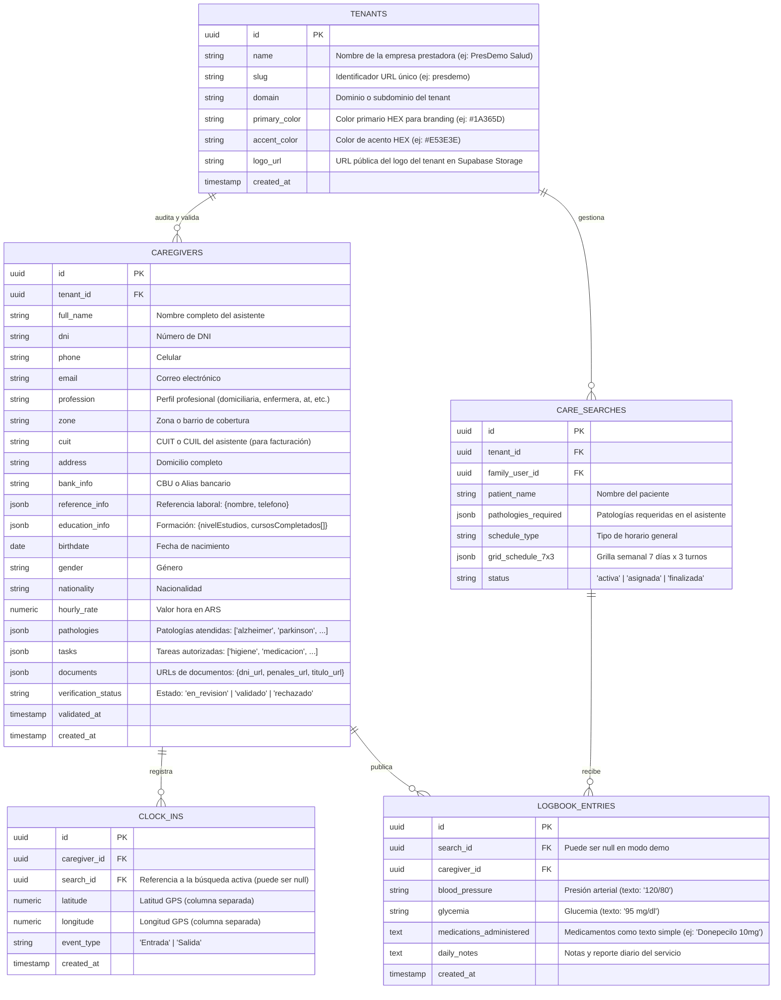

# Plan de Migración e Integración con Supabase Backend (Careonys SaaS - CeltaTech)

**Guía Técnica de Esquema de Base de Datos, Políticas RLS y Conexión de API**  
**Fecha de Documentación**: Agosto de 2026 (Revisión 2 — Sincronizada con `js/apiClient.js`)  
**Desarrollador del Software**: **CeltaTech**  
**Producto**: **Careonys SaaS** (Módulo Marketplace)  
**Ubicación**: `docs/plan_migracion_supabase.md`

> [!IMPORTANT]
> Esta revisión corrige las discrepancias identificadas en la Auditoría Senior entre el esquema SQL original
> y la capa cliente real en [js/apiClient.js](file:///f:/proyectos/Careonys-Marketplace/js/apiClient.js).
> Usar exclusivamente **este SQL actualizado** para crear las tablas en Supabase.

---

## 1. Arquitectura de Conexión de la Capa de Abstracción (`js/apiClient.js`)

El frontend del proyecto ya cuenta con la capa de abstracción `CareonysAPI` en [js/apiClient.js](file:///f:/proyectos/Careonys-Marketplace/js/apiClient.js).

Para pasar de Mock/LocalStorage a **Supabase en Producción**, solo se deben seguir dos pasos:

```javascript
// 1. En js/apiClient.js (ya habilitado):
CareonysAPI.useSupabase = true;
CareonysAPI.supabaseUrl = 'https://tu-proyecto.supabase.co';
CareonysAPI.supabaseKey = 'tu-anon-key-publica';
```

---

## 2. Esquema Relacional de Tablas en Supabase (PostgreSQL)



---

## 3. SQL Completo para Crear las Tablas (Versión Corregida)

```sql
-- ============================================
-- Extensiones necesarias
-- ============================================
CREATE EXTENSION IF NOT EXISTS "uuid-ossp";

-- ============================================
-- TABLA: tenants
-- Sincronizada con CareonysAPI.initTenant()
-- ============================================
CREATE TABLE tenants (
  id             UUID PRIMARY KEY DEFAULT uuid_generate_v4(),
  name           TEXT NOT NULL,
  slug           TEXT NOT NULL UNIQUE,     -- ← Requerido para resolver tenant por URL
  domain         TEXT,
  primary_color  TEXT DEFAULT '#1A365D',   -- ← Requerido para branding dinámico
  accent_color   TEXT DEFAULT '#E53E3E',   -- ← Requerido para branding dinámico
  logo_url       TEXT,                     -- ← Requerido para logo dinámico
  created_at     TIMESTAMPTZ DEFAULT NOW()
);

-- Índice de búsqueda por slug
CREATE UNIQUE INDEX idx_tenants_slug ON tenants (slug);

-- Dato inicial del tenant demo
INSERT INTO tenants (id, name, slug, primary_color, accent_color, logo_url)
VALUES (
  '2197bc14-d545-4939-9a98-979e69a120dc',
  'PresDemo — Servicios de Cuidado',
  'presdemo',
  '#1A365D',
  '#E53E3E',
  'assets/images/logo_presdemo.png'
);

-- ============================================
-- TABLA: caregivers
-- Sincronizada con CareonysAPI._mapToDatabase()
-- ============================================
CREATE TABLE caregivers (
  id                    UUID PRIMARY KEY DEFAULT uuid_generate_v4(),
  tenant_id             UUID REFERENCES tenants(id) ON DELETE CASCADE,
  full_name             TEXT NOT NULL,
  dni                   TEXT,
  phone                 TEXT,
  email                 TEXT,
  profession            TEXT,
  zone                  TEXT,
  cuit                  TEXT,            -- ← Añadido: requerido por el formulario
  address               TEXT,            -- ← Añadido: domicilio
  bank_info             TEXT,            -- ← Añadido: CBU o alias
  reference_info        JSONB,           -- ← Añadido: {nombre, telefono} de referente
  education_info        JSONB,           -- ← Añadido: {nivelEstudios, cursosCompletados[]}
  birthdate             DATE,            -- ← Añadido: fecha de nacimiento
  gender                TEXT,            -- ← Añadido
  nationality           TEXT,            -- ← Añadido
  hourly_rate           NUMERIC(10,2),   -- ← Añadido: valor hora en ARS
  pathologies           JSONB,
  tasks                 JSONB,
  documents             JSONB,
  verification_status   TEXT DEFAULT 'en_revision',
  validated_at          TIMESTAMPTZ,
  created_at            TIMESTAMPTZ DEFAULT NOW()
);

-- ============================================
-- TABLA: care_searches (Búsquedas de Familias)
-- ============================================
CREATE TABLE care_searches (
  id                    UUID PRIMARY KEY DEFAULT uuid_generate_v4(),
  tenant_id             UUID REFERENCES tenants(id) ON DELETE CASCADE,
  family_user_id        UUID,
  patient_name          TEXT,
  pathologies_required  JSONB,
  schedule_type         TEXT,
  grid_schedule_7x3     JSONB,
  status                TEXT DEFAULT 'activa',
  created_at            TIMESTAMPTZ DEFAULT NOW()
);

-- ============================================
-- TABLA: clock_ins (Fichados GPS)
-- CORREGIDO: latitude + longitude como campos
-- separados en lugar de un tipo point único.
-- Sincronizado con CareonysAPI.registrarFichadoGPS()
-- ============================================
CREATE TABLE clock_ins (
  id            UUID PRIMARY KEY DEFAULT uuid_generate_v4(),
  caregiver_id  UUID REFERENCES caregivers(id) ON DELETE CASCADE,
  search_id     UUID REFERENCES care_searches(id) ON DELETE SET NULL,
  latitude      NUMERIC(10, 7) NOT NULL,  -- ← Corregido: campo separado
  longitude     NUMERIC(10, 7) NOT NULL,  -- ← Corregido: campo separado
  event_type    TEXT NOT NULL,             -- ← 'Entrada' o 'Salida'
  created_at    TIMESTAMPTZ DEFAULT NOW()
);

-- ============================================
-- TABLA: logbook_entries (Bitácora Médica)
-- CORREGIDO: medications_administered es TEXT,
-- no JSONB. Sincronizado con el formulario PWA.
-- ============================================
CREATE TABLE logbook_entries (
  id                       UUID PRIMARY KEY DEFAULT uuid_generate_v4(),
  search_id                UUID REFERENCES care_searches(id) ON DELETE SET NULL,
  caregiver_id             UUID REFERENCES caregivers(id) ON DELETE CASCADE,
  blood_pressure           TEXT,
  glycemia                 TEXT,
  medications_administered TEXT,   -- ← Corregido: TEXT simple, no JSONB
  daily_notes              TEXT,
  created_at               TIMESTAMPTZ DEFAULT NOW()
);
```

---

## 4. Políticas de Seguridad RLS (Row Level Security)

```sql
-- 1. Activar RLS en todas las tablas
ALTER TABLE tenants ENABLE ROW LEVEL SECURITY;
ALTER TABLE caregivers ENABLE ROW LEVEL SECURITY;
ALTER TABLE care_searches ENABLE ROW LEVEL SECURITY;
ALTER TABLE clock_ins ENABLE ROW LEVEL SECURITY;
ALTER TABLE logbook_entries ENABLE ROW LEVEL SECURITY;

-- 2. Política: La prestadora solo ve los cuidadores y búsquedas de su Tenant
CREATE POLICY "Tenant Isolation Caregivers" ON caregivers
  FOR ALL USING (tenant_id = (auth.jwt() ->> 'tenant_id')::uuid);

-- 3. Política: La familia solo ve los cuidadores validados
CREATE POLICY "Public Approved Caregivers" ON caregivers
  FOR SELECT USING (verification_status = 'validado');

-- 4. Política: Los registros de bitácora son públicos para lectura dentro del tenant
CREATE POLICY "Tenant Logbook Read" ON logbook_entries
  FOR SELECT USING (true);

-- 5. Política de escritura para clock_ins: solo el cuidador propietario puede insertar
CREATE POLICY "Caregiver Clock Ins" ON clock_ins
  FOR INSERT WITH CHECK (caregiver_id::text = auth.uid()::text);
```

---

## 5. Checklist para Iniciar la Migración a Supabase

1. 🟩 **Paso 1**: Crear el proyecto en [supabase.com](https://supabase.com).
2. 🟩 **Paso 2**: Ejecutar el script SQL completo de la Sección 3 en el SQL Editor.
3. 🟩 **Paso 3**: Obtener la `SUPABASE_URL` y la `SUPABASE_ANON_KEY` en `Project Settings > API`.
4. 🟩 **Paso 4**: Actualizar en [js/apiClient.js](file:///f:/proyectos/Careonys-Marketplace/js/apiClient.js):
   ```javascript
   supabaseUrl: 'https://TU-PROYECTO.supabase.co',
   supabaseKey: 'tu-anon-key-publica',
   ```
5. 🟩 **Paso 5**: Copiar los archivos actualizados `js/apiClient.js` a las carpetas de las PWAs:
   ```
   pwa-asistente/js/apiClient.js
   pwa-familia/js/apiClient.js
   ```
6. 🟩 **Paso 6**: Habilitar las políticas RLS de la Sección 4 desde el panel de Supabase.
