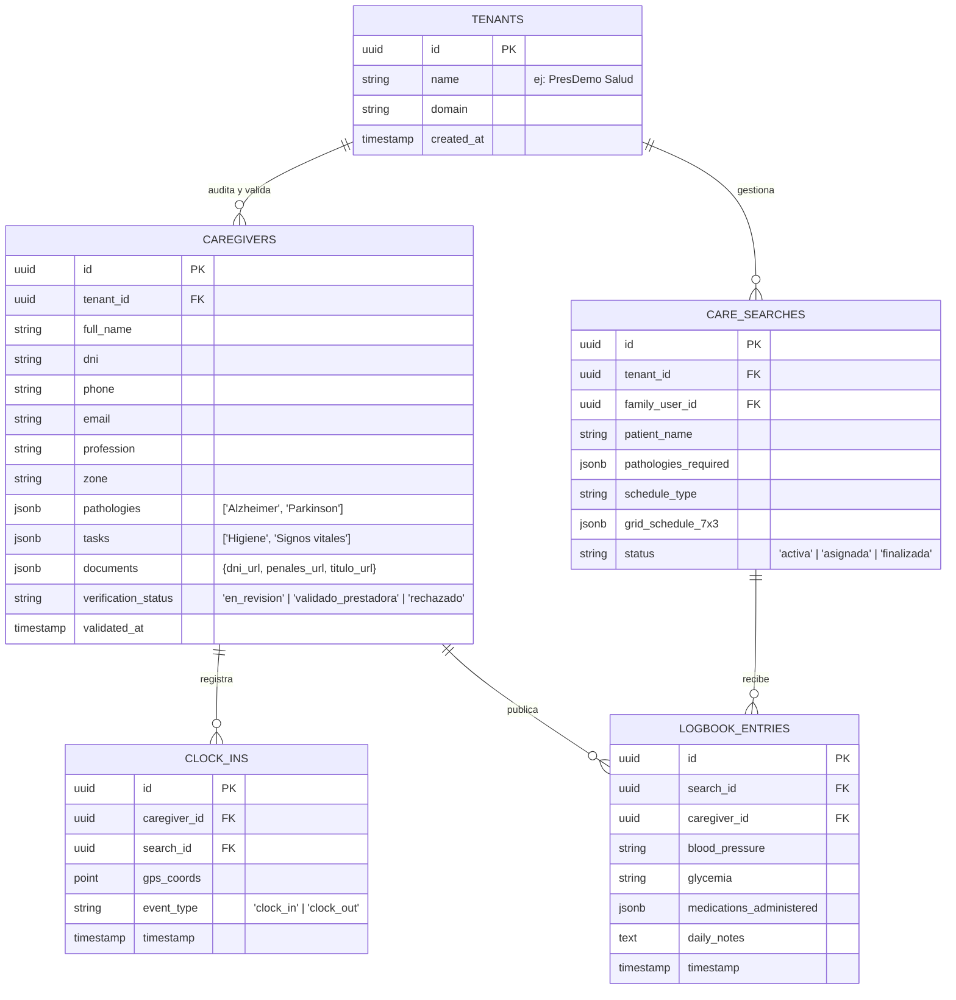

# Plan de Migración e Integración con Supabase Backend (Careonys SaaS - CeltaTech)

**Guía Técnica de Esquema de Base de Datos, Políticas RLS y Conexión de API**  
**Fecha de Documentación**: 4 de Agosto de 2026  
**Desarrollador del Software**: **CeltaTech**  
**Producto**: **Careonys SaaS** (Módulo Marketplace)  
**Ubicación**: `docs/plan_migracion_supabase.md`  

---

## 1. Arquitectura de Conexión de la Capa de Abstracción (`js/apiClient.js`)

El frontend del proyecto ya cuenta con la capa de abstracción `CareonysAPI` en [js/apiClient.js](file:///f:/proyectos/Careonys-Marketplace/js/apiClient.js).

Para pasar de Mock/LocalStorage a **Supabase en Producción**, solo se deben seguir dos pasos:

```javascript
// 1. En js/apiClient.js:
CareonysAPI.useSupabase = true;
CareonysAPI.supabaseUrl = 'https://tu-proyecto.supabase.co';
CareonysAPI.supabaseKey = 'tu-anon-key-publica';
```

---

## 2. Esquema Relacional de Tablas en Supabase (PostgreSQL)



---

## 3. Políticas de Seguridad RLS (Row Level Security)

```sql
-- 1. Activar RLS en todas las tablas
ALTER TABLE caregivers ENABLE ROW LEVEL SECURITY;
ALTER TABLE care_searches ENABLE ROW LEVEL SECURITY;
ALTER TABLE clock_ins ENABLE ROW LEVEL SECURITY;

-- 2. Política: La prestadora solo ve los cuidadores y búsquedas de su Tenant
CREATE POLICY "Tenant Isolation Caregivers" ON caregivers
  FOR ALL USING (tenant_id = auth.jwt() ->> 'tenant_id');

-- 3. Política: La familia solo ve los cuidadores en estado 'validado_prestadora'
CREATE POLICY "Public Approved Caregivers" ON caregivers
  FOR SELECT USING (verification_status = 'validado_prestadora');
```

---

## 4. Checklist para Iniciar la Migración a Supabase

Cuando decidas dar el paso a Supabase, el procedimiento será:

1. 🟩 **Paso 1**: Crear el proyecto en [supabase.com](https://supabase.com).
2. 🟩 **Paso 2**: Ejecutar el script SQL de creación de tablas de la Sección 2.
3. 🟩 **Paso 3**: Obtener la `SUPABASE_URL` y la `SUPABASE_ANON_KEY`.
4. 🟩 **Paso 4**: Activar `CareonysAPI.useSupabase = true;` en [js/apiClient.js](file:///f:/proyectos/Careonys-Marketplace/js/apiClient.js).
